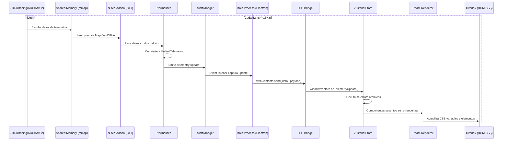

# ARQUITECTURA - Vantare Overlays v1.0

> Documento tecnico de arquitectura del sistema Vantare Overlays.
> Version: 1.0.0 | Ultima actualizacion: Junio 2026

---

## Tabla de Contenidos

1. [Vision General del Sistema](#1-vision-general-del-sistema)
2. [Stack Tecnologico Completo](#2-stack-tecnologico-completo)
3. [Arquitectura del Sistema](#3-arquitectura-del-sistema)
4. [Flujo de Datos (Telemetry Pipeline)](#4-flujo-de-datos-telemetry-pipeline)
5. [Modelo de Telemetria Unificada](#5-modelo-de-telemetria-unificada)
6. [Modelo de Distribucion Hybrid](#6-modelo-de-distribucion-hybrid)
7. [Estructura del Monorepo](#7-estructura-del-monorepo)
8. [IPC Bridge](#8-ipc-bridge)
9. [Soporte Multi-Sim](#9-soporte-multi-sim)
10. [Sistema de Overlays](#10-sistema-de-overlays)
11. [Sistema de Temas](#11-sistema-de-temas)
12. [Autenticacion y Licencias](#12-autenticacion-y-licencias)
13. [Consideraciones de Rendimiento](#13-consideraciones-de-rendimiento)
14. [Seguridad](#14-seguridad)
15. [Ventajas Competitivas vs RaceLabs](#15-ventajas-competitivas-vs-racelabs)
16. [Diagrama de Componentes](#16-diagrama-de-componentes)

---

## 1. Vision General del Sistema

### 1.1 Que es Vantare Overlays?

Vantare Overlays es una aplicacion de escritorio profesional disenada para simracing, que permite a los corredores virtuales crear, personalizar y mostrar overlays de telemetria en tiempo real sobre sus sesiones de carrera. La aplicacion se ejecuta como proceso nativo en Windows, capturando datos de telemetria directamente desde los sims de carrera a traves de memoria compartida (mmap) y renderizando overlays personalizables que pueden integrarse con OBS Studio, plataformas de streaming o mostrarse directamente en pantalla.

### 1.2 Proposito del Producto

El proposito central de Vantare es resolver tres problemas fundamentales del ecosistema de simracing:

1. **Fragmentacion de herramientas**: Los simracers actualmente necesitan multiples aplicaciones separadas para telemetria, overlays, analisis post-carrera y streaming. Vantare unifica todo en una sola plataforma.

2. **Latencia insatisfactoria**: Las soluciones existentes procesan telemetria con latencias de 50-200ms. Vantare logra latencias sub-16ms gracias a su pipeline optimizado de mmap zero-copy.

3. **Falta de personalizacion**: Las soluciones actuales ofrecen plantillas rigidas. Vantare proporciona un sistema de temas CSS completo, soporte para Tailwind CSS y la capacidad de crear overlays completamente customizados desde cero.

### 1.3 Publico Objetivo

- Simracers recreacionales que buscan mejorar su experiencia de streaming
- Pilotos profesionales de esports que necesitan telemetria precisa en tiempo real
- Equipos de racing que requieren dashboards de datos para estrategia en carrera
- Creadores de contenido que buscan overlays atractivos para sus transmisiones

### 1.4 Landscape Competitivo

El mercado actual de overlays para simracing esta dominado por soluciones que, aunque funcionales, presentan limitaciones significativas:

| Solucion | Ventaja | Limitacion Principal |
|----------|---------|---------------------|
| RaceLabs | Madurez del producto, gran base de usuarios | Closed-source, costoso, sin soporte multi-sim nativo |
| SimHub | Excelente soporte de hardware, gratuito | Interfaz compleja, overlays basicos |
| iOverlay | Simple de usar | Limitado a iRacing, pocas opciones de customizacion |
| SDK nativos | Baja latencia por diseño | Requieren desarrollo custom, sin interfaz visual |

Vantare se posiciona como la solucion open-hybrid que combina la potencia de una aplicacion de escritorio nativa con la flexibilidad de un servidor HTTP para integracion con OBS, todo mientras mantiene la telemetria local y segura.

### 1.5 Principios de Diseno

- **Privacidad primero**: Ningun dato de telemetria abandona la maquina del usuario
- **Rendimiento como feature**: 16Hz de actualizacion con zero-copy via mmap
- **Modularidad extrema**: Cada componente es un paquete independiente en el monorepo
- **Experiencia nativa**: Electron con fuses de seguridad para proteccion del usuario
- **Extensible**: API abierta para soporte de nuevos sims y plugins de la comunidad

---

## 2. Stack Tecnologico Completo

### 2.1 Tabla de Stack

| Capa | Tecnologia | Justificacion |
|------|-----------|---------------|
| **Runtime** | Electron 32+ | Framework de escritorio cross-platform con soporte nativo para IPC, BrowserWindows y system tray |
| **Frontend** | React 19 | Rendering declarativo de overlays con soporte para React.memo y selectors de Zustand |
| **Estado Global** | Zustand 5 | Store ligero sin boilerplate, selectors atomicos para minimizar re-renders |
| **Estilos** | Tailwind CSS v4.2 | Runtime browser para development, compilado para production. CSS variables para temas |
| **Build System** | Turborepo | Monorepo management con caching incremental y build orchestration |
| **Bundler** | Vite 6 | HMR rapido en desarrollo, build optimizado con tree-shaking para production |
| **Lenguaje** | TypeScript 5.6 | Type safety en todo el stack, interfaces compartidas via @vantare/types |
| **Telemetria** | node-addon-api (N-API) | Acceso directo a shared memory (mmap) de sims via native addons compilados |
| **Base de Datos Local** | better-sqlite3 | Almacenamiento local de configuraciones, historial de sesiones y cache de temas |
| **Auth Backend** | Supabase | Autenticacion, gestion de licencias y feature gating via Edge Functions |
| **HTTP Server** | Express.js | Servidor HTTP embebido en el proceso principal para servir overlays via browser sources |
| **SSE** | Server-Sent Events | Streaming de telemetria en tiempo real desde el servidor HTTP hacia los overlays |
| **Lottie** | lottie-web | Animaciones vectoriales para splash screens y transiciones de overlay |
| **Iconos** | Lucide React | Iconografia consistente y ligera para la UI de configuracion |
| **Testing** | Vitest + Testing Library | Unit testing rapido con soporte nativo para ESM y TypeScript |
| **E2E Testing** | Playwright | Pruebas end-to-end del flow completo de la aplicacion |
| **CI/CD** | GitHub Actions | Build, test y release automatizados con matrix de Windows |
| **Paquetes Nativos** | prebuild-install | Distribucion de native addons pre-compilados para evitar rebuilds en instalacion |

### 2.2 Decisiones Arquitectonicas Clave

**Por que Electron y no una app web pura?**
- Acceso directo a mmap de sims de carrera (iRacing, ACC, AMS2)
- Capacidades de system tray y overlay global (always-on-top)
- IPC seguro via contextBridge sin expiar Node.js al renderer
- Permisos de admin para acceso a memoria compartida del sim

**Por que Zustand y no Redux?**
- Sin boilerplate de reducers/actions
- Selectores atomicos con comparacion por referencia
- Soporte nativo para middlewares (persist, devtools)
- Bundle size minimo (~2KB gzipped)

**Por que un servidor HTTP embebido?**
- OBS Studio puede capturar overlays via Browser Source apuntando a localhost
- Compatible con cualquier software de captura que soporte HTTP
- Los overlays pueden ejecutarse en cualquier navegador
- Permite testing independiente del renderer de Electron

---

## 3. Arquitectura del Sistema

### 3.1 Diagrama de Arquitectura de Alto Nivel

```
+=============================================================================+
|                         VANTARE OVERLAYS v1.0                                |
+=============================================================================+

  +------------------+     +------------------+     +------------------+
  |   iRacing        |     |   ACC            |     |   AMS2           |
  |   (Shared Mem)   |     |   (Shared Mem)   |     |   (Shared Mem)   |
  +--------+---------+     +--------+---------+     +--------+---------+
           |                       |                       |
           v                       v                       v
  +=================================================================+
  |                    SIM ADAPTERS (N-API / mmap)                  |
  |  +-------------------+  +------------------+  +----------------+ |
  |  | iRacingAdapter    |  | ACCAdapter       |  | AMS2Adapter    | |
  |  | - TelemetryData   |  | - TelemetryData  |  | - TelemetryData| |
  |  | - SessionData     |  | - StaticData     |  | - GameData     | |
  |  | - WeatherData     |  | - PhysicsData    |  | - Participants | |
  |  +-------------------+  +------------------+  +----------------+ |
  +===========================+=====================================+
                              |
                              v
  +=================================================================+
  |                    SIM MANAGER                                  |
  |  - Auto-detection of running sim                                 |
  |  - Adapter lifecycle management                                  |
  |  - Unified telemetry normalization                               |
  |  - Event emitter for telemetry updates                           |
  +===========================+=====================================+
                              |
                              v
  +=================================================================+
  |                 MAIN PROCESS (Electron Main)                    |
  |                                                                 |
  |  +-----------------+   +------------------+   +---------------+ |
  |  | Telemetry       |   | HTTP Server      |   | Window        | |
  |  | Normalizer      |   | (Express:3200)   |   | Manager       | |
  |  | - UnifiedTelm   |   | - /api/telemetry |   | - BrowserWin  | |
  |  | - VehicleData   |   | - /api/sessions  |   | - TrayIcon    | |
  |  | - PlayerData    |   | - /api/settings  |   | - Menus       | |
  |  | - EngineData    |   | - SSE /events    |   | - Overlays    | |
  |  +-----------------+   +------------------+   +---------------+ |
  |                                                                 |
  +===========================+=====================================+
                              |
                              v
  +=================================================================+
  |                 IPC BRIDGE (contextBridge)                       |
  |  window.vantare = {                                              |
  |    getTelemetry, onTelemetryUpdate, getSettings,                 |
  |    setOverlayPosition, setOverlayVisible, getTheme, setTheme     |
  |  }                                                              |
  +===========================+=====================================+
                              |
                              v
  +=================================================================+
  |              RENDERER PROCESS (React / Zustand)                 |
  |                                                                 |
  |  +------------------+   +------------------+   +---------------+ |
  |  | Zustand Store    |   | React Components |   | Theme Engine  | |
  |  | - telemetryData  |-->| - OverlayHud     |   | - CSS Vars    | |
  |  | - settings       |   | - DashSpeed      |   | - Tailwind    | |
  |  | - theme          |   | - DashRPM        |   | - Custom CSS  | |
  |  | - connection     |   | - TyreWidget     |   | - Dark/Light  | |
  |  |   Status         |   | - LapTimes       |   +---------------+ |
  |  +------------------+   | - TrackMap       |                     |
  |                         | - WeatherWidget  |                     |
  |                         +------------------+                     |
  +===========================+=====================================+
                              |
                              v
  +=================================================================+
  |                      OVERLAYS OUTPUT                             |
  |                                                                 |
  |  +-------------------+        +----------------------------+    |
  |  | Electron Window   |        | OBS Studio Browser Source  |    |
  |  | (Overlay Mode)    |        | http://localhost:3200/     |    |
  |  | - Always-on-top   |        | - Transparent background   |    |
  |  | - Click-through   |        | - Custom resolution        |    |
  |  | - GPU isolated    |        | - Per-overlay URL          |    |
  |  +-------------------+        +----------------------------+    |
  |                                                                 |
  +=================================================================+
```

### 3.2 Capas de la Arquitectura

La arquitectura de Vantare se organiza en 5 capas claramente separadas:

1. **Capa de Captura**: Los SimAdapters leen datos directamente de la memoria compartida de cada sim via N-API addons compilados en C++. Esta capa es la mas cercana al hardware del sim y es responsable de la lectura cruda de datos.

2. **Capa de Normalizacion**: El SimManager orquesta los adapters y el Normalizer transforma los datos brutos de cada sim en un modelo unificado de telemetria (UnifiedTelemetry). Esta abstraccion permite que el resto del sistema no necesite conocer las particularidades de cada sim.

3. **Capa de Proceso Principal**: Electron Main maneja la ventana del sistema, el system tray, el servidor HTTP embebido y la distribucion de eventos de telemetria hacia los renderers via IPC.

4. **Capa de Renderizado**: Los procesos renderer de React consumen los datos via Zustand y renderizan los componentes de overlay con el tema activo. Esta capa esta completamente aislada del proceso principal via contextBridge.

5. **Capa de Salida**: Los overlays se exportan via dos canales: ventanas Electron con always-on-top y click-through, o el servidor HTTP para captura via OBS Browser Sources.

---

## 4. Flujo de Datos (Telemetry Pipeline)

### 4.1 Pipeline Completo Paso a Paso

El pipeline de telemetria de Vantare es el corazon del sistema. Cada dato viaja desde la memoria compartida del sim hasta el pixel renderizado en pantalla a traves de los siguientes pasos:

**Paso 1 - Shared Memory (mmap)**
El sim de carrera escribe datos de telemetria en un region de memoria compartida (memory-mapped file) en intervals regulares. Cada sim tiene su propio formato: iRacing usa `irsdk_MemoryMap`, ACC usa shared memory con header specifico, AMS2 usa su propio esquema. El addon nativo de N-API abre esta region de memoria con `MapViewOfFile` en Windows.

**Paso 2 - N-API Read**
El addon nativo (compilado en C++) lee los bytes crudos de la shared memory y los convierte en objetos JavaScript. Este paso ocurre en el thread del addon, bloqueando la memoria solo durante la lectura (típicamente <0.1ms). Los datos se pasan al thread principal de Node.js via `Napi::ThreadSafeFunction`.

**Paso 3 - Normalizer**
El Normalizer toma los datos crudos del adapter especifico del sim y los transforma al modelo `UnifiedTelemetry`. Aqui se realizan conversiones de unidades (mph a kph, Fahrenheit a Celsius), interpolaciones si es necesario y validacion de rangos. El normalizer es una funcion pura sin side effects.

**Paso 4 - SimManager**
El SimManager mantiene el adapter activo y emite eventos `'telemetry-update'` cada vez que llegan datos nuevos. Tambien gestiona el auto-detection: cuando el usuario inicia un sim, el SimManager detecta la shared memory activa y selecciona el adapter apropiado automaticamente.

**Paso 5 - IPC Distribution**
El proceso principal de Electron recibe el evento del SimManager y lo distribuye a todos los BrowserWindows abiertos via `webContents.send('telemetry-update', data)`. El payload es serializado via structured clone, que es mas rapido que JSON.stringify/parse.

**Paso 6 - Zustand Store**
En el proceso renderer, el listener de IPC actualiza el Zustand store via `setTelemetry(data)`. Zustand ejecuta los selectors suscritos y solo re-renderiza los componentes que usan datos que cambiaron. Los selectors atomicos (ej: `useSpeed()`, `useRPM()`) minimizan el numero de re-renders.

**Paso 7 - React Render**
React aplica los cambios al DOM virtual y ejecuta el reconciliation. Gracias a React.memo y a que los overlays son componentes relativamente simples, el re-render tipico toma <2ms.

**Paso 8 - CSS Paint**
Los estilos se aplican via CSS variables actualizadas dinamicamente. Las animaciones de valores (como la barra de RPM) usan transiciones CSS en lugar de JavaScript para aprovechar el compositor del navegador y mantener 60fps de animacion incluso cuando la telemetria llega a 16Hz.

### 4.2 Diagrama de Secuencia Mermaid



### 4.3 Rate Limiting y Throttling

Para evitar saturar el pipeline, Vantare implementa varias estrategias:

- **Shared Memory Polling**: El addon N-API consulta la shared memory cada 62ms (16Hz), alineado con el rate tipico de los sims
- **IPC Throttling**: El proceso principal limita las actualizaciones IPC a 16Hz maximo, incluso si el sim emite a mayor frecuencia
- **Zustand Batching**: Zustand agrupa multiples actualizaciones en un solo commit para evitar re-renders parciales
- **CSS Transitions**: Las transiciones CSS interpolan visualmente entre actualizaciones, creando la ilusion de mayor fluidez
- **Selective Updates**: Solo los campos que cambiaron se envian via IPC, no el objeto completo de telemetria

---

## 5. Modelo de Telemetria Unificada

### 5.1 Interfaces TypeScript

El modelo de telemetria unificada es el contrato de datos que fluye a traves de todo el sistema. Cada adapter de sim es responsable de mapear sus datos nativos a estas interfaces.

```typescript
// ==========================================
// @vantare/types - UnifiedTelemetry v1.0
// ==========================================

/**
 * Interfaz raiz que encapsula todo el estado de telemetria
 * en un unico objeto inmutable en cada tick de actualizacion.
 */
export interface UnifiedTelemetry {
  /** Marca de tiempo del tick de telemetria (DOMHighResTimeStamp) */
  timestamp: number;

  /** Identificador del sim activo */
  simId: SimId;

  /** Estado general de la sesion */
  session: SessionData;

  /** Datos del jugador principal */
  player: PlayerData;

  /** Datos del vehiculo */
  vehicle: VehicleData;

  /** Datos del motor */
  engine: EngineData;

  /** Datos de los neumaticos (4 posiciones) */
  tyres: TyreData[];

  /** Datos de la vuelta actual */
  lap: LapData;

  /** Datos de la pista */
  track: TrackData;

  /** Inputs del piloto */
  input: InputData;

  /** Datos meteorologicos */
  weather: WeatherData;

  /** Estado de la conexion con el sim */
  connection: ConnectionState;
}

export type SimId = 'iracing' | 'acc' | 'ams2' | 'rfactor2' | 'assetto' | 'unknown';

export type ConnectionState = 'connected' | 'disconnected' | 'reconnecting';

/**
 * Datos del vehiculo en tiempo real.
 * Todos los valores numericos estan en unidades metricas.
 */
export interface VehicleData {
  /** Velocidad actual en km/h */
  speedKph: number;

  /** Velocidad en MPH (calculada) */
  speedMph: number;

  /** Velocidad en m/s para calculos fisicos */
  speedMs: number;

  /** Posicion en pista (distancia desde start/finish) en metros */
  trackPositionM: number;

  /** Posicion en la carrera (1-based) */
  racePosition: number;

  /** Total de vueltas completadas */
  completedLaps: number;

  /** Distancia total recorrida en metros */
  totalDistanceM: number;

  /** Fuel restante en litros */
  fuelRemainingL: number;

  /** Consumo de fuel estimado en litros por vuelta */
  fuelConsumptionPerLap: number;

  /** Vueltas de fuel restantes estimadas */
  fuelEstimatedLaps: number;

  /** Peso del vehiculo en kg */
  weightKg: number;

  /** DRS disponible (solo F1/open-wheel) */
  drsAvailable: boolean;

  /** DRS activo */
  drsActive: boolean;

  /** ERS deployment mode */
  ersMode: ErsMode;

  /** Energy recovery remaining (0-100%) */
  ersEnergyPercent: number;
}

export type ErsMode = 'off' | 'mode1' | 'mode2' | 'mode3' | 'mode4' | 'hotlap' | 'overtake';

/**
 * Datos del jugador principal.
 */
export interface PlayerData {
  /** Nombre del piloto */
  name: string;

  /** Numero del vehiculo */
  carNumber: string;

  /** Nombre del equipo */
  teamName: string;

  /** Clase del vehiculo */
  carClass: string;

  /** Licencia/rating del jugador (si aplica) */
  irating?: number;

  /** Safety rating (si aplica) */
  safetyRating?: number;

  /** Si el jugador esta en pits */
  inPits: boolean;

  /** Tiempo en pits actual en segundos */
  pitTimeS: number;

  /** Numero de penalizaciones */
  penalties: number;

  /** Tiempo total de penalizacion en segundos */
  penaltyTimeS: number;
}

/**
 * Datos del motor y sistema de propulsion.
 */
export interface EngineData {
  /** RPM actual del motor */
  rpm: number;

  /** RPM maximo del motor */
  rpmMax: number;

  /** RPM de corte (redline) */
  rpmRedline: number;

  /** Cambio actual (0 = neutral, -1 = retro) */
  gear: number;

  /** Numero total de marchas */
  totalGears: number;

  /** Nombre del marcha actual */
  gearLabel: string;

  /** Temperatura del motor en Celsius */
  waterTempC: number;

  /** Temperatura del aceite en Celsius */
  oilTempC: number;

  /** Presion del aceite en kPa */
  oilPressureKpa: number;

  /** Presion del combustible en kPa */
  fuelPressureKpa: number;

  /** Turbo boost en PSI (si aplica) */
  boostPsi: number;

  /** Potencia del motor en CV */
  powerCv: number;

  /** Torque del motor en Nm */
  torqueNm: number;

  /** Throttle position (0-100%) */
  throttlePercent: number;

  /** Brake bias delantero (0-100%) */
  brakeBiasFront: number;

  /** Clutch engagement (0-100%) */
  clutchPercent: number;
}

/**
 * Datos de cada neumatico. Array de 4 elementos:
 * [FL, FR, RL, RR]
 */
export interface TyreData {
  /** Posicion del neumatico */
  position: TyrePosition;

  /** Temperatura de la superficie en Celsius */
  surfaceTempC: number;

  /** Temperatura interna en Celsius */
  innerTempC: number;

  /** Temperatura del carcasa en Celsius */
  carcassTempC: number;

  /** Presion en PSI */
  pressurePsi: number;

  /** Presion optima en PSI */
  optimalPressurePsi: number;

  /** Desgaste del neumatico (0-100%, 100 = nuevo) */
  wearPercent: number;

  /** Grip level (0-1) */
  gripLevel: number;

  /** Profundidad del surco en mm */
  treadDepthMm: number;

  /** Desgaste desigual interno (0-1) */
  wearInner: number;

  /** Desgaste desigual externo (0-1) */
  wearOuter: number;

  /** Temperature desgaste desigual interno (0-1) */
  temperatureInner: number;

  /** Temperature desgaste desigual externo (0-1) */
  temperatureOuter: number;

  /** Brakes temperature en Celsius */
  brakeTempC: number;

  /** Brakes pressure */
  brakePressure: number;
}

export type TyrePosition = 'FL' | 'FR' | 'RL' | 'RR';

/**
 * Datos de la vuelta actual y historial.
 */
export interface LapData {
  /** Numero de la vuelta actual */
  currentLap: number;

  /** Tiempo de la vuelta actual en milisegundos */
  currentLapTimeMs: number;

  /** Mejor vuelta personal de la sesion en ms */
  bestLapTimeMs: number;

  /** Vuelta de la mejor marca */
  bestLapNumber: number;

  /** Ultima vuelta completada en ms */
  lastLapTimeMs: number;

  /** Delta con la mejor vuelta en ms (negativo = mas rapido) */
  deltaBestMs: number;

  /** Sector actual (1-3) */
  currentSector: number;

  /** Tiempo del sector actual en ms */
  currentSectorTimeMs: number;

  /** Mejores tiempos por sector */
  bestSectorTimesMs: number[];

  /** Sector del best lap */
  bestLapSectorsMs: number[];

  /** Split 1 delta en ms */
  split1DeltaMs: number;

  /** Split 2 delta en ms */
  split2DeltaMs: number;

  /** Crossed finish line flag */
  crossedFinishLine: boolean;

  /** Is personal best */
  isPersonalBest: boolean;

  /** Is optimal lap (sum of best sectors) */
  isOptimalLap: boolean;
}

/**
 * Datos de la sesion de carrera/entrenamiento.
 */
export interface SessionData {
  /** Tipo de sesion */
  sessionType: SessionType;

  /** Nombre de la sesion */
  sessionName: string;

  /** Tiempo restante en la sesion en milisegundos */
  timeRemainingMs: number;

  /** Duracion total de la sesion en milisegundos */
  sessionDurationMs: number;

  /** Total de participantes */
  totalParticipants: number;

  /** Si la sesion esta en periodo de warmup */
  isWarmup: boolean;

  /** Si la sesion ha terminado */
  isFinished: boolean;

  /** Red flag activa */
  redFlag: boolean;

  /** Safety car activo */
  safetyCarActive: boolean;

  /** Virtual safety car */
  virtualSafetyCar: boolean;

  /** Lap actual / total de vueltas (0 si es por tiempo) */
  currentLapOfTotal: number;

  /** Total de vueltas programadas */
  totalLaps: number;
}

export type SessionType = 'practice' | 'qualifying' | 'race' | 'hotlap' | 'timeTrial';

/**
 * Datos de la pista.
 */
export interface TrackData {
  /** Nombre de la pista */
  name: string;

  /** Configuracion de la pista (layout) */
  configName: string;

  /** Longitud de la pista en metros */
  lengthM: number;

  /** Numero de curvas */
  totalTurns: number;

  /** Vuelta actual del circuito (para circuitos con vueltas) */
  currentLapInCircuit: number;

  /** Fraccion de la vuelta completada (0-1) */
  lapFraction: number;

  /** Distancia al fin de la vuelta en metros */
  distanceToLapEndM: number;

  /** Surface grip level (0-1) */
  surfaceGrip: number;

  /** Track temperature en Celsius */
  surfaceTempC: number;

  /** Iluminacion ambient en lux */
  ambientLux: number;

  /** Si esta en el pit lane */
  onPitLane: boolean;

  /** Posicion del auto en el mapa (x, y normalizado) */
  mapPosition: { x: number; y: number };

  /** Coordenadas del path de la pista para el mapa */
  trackPath: Array<{ x: number; y: number }>;

  /** Sector boundaries (distancias en metros) */
  sectorSplitsM: number[];
}

/**
 * Inputs del piloto.
 */
export interface InputData {
  /** Posicion del acelerador (0-1) */
  throttle: number;

  /** Presion del freno (0-1) */
  brake: number;

  /** Posicion del clutch (0-1) */
  clutch: number;

  /** Angulo del volante en grados */
  steeringAngleDeg: number;

  /** Fuerza de feedback del volante en Nm */
  forceFeedbackNm: number;

  /** Si el ABS esta activo */
  absActive: boolean;

  /** Si el traction control esta activo */
  tcActive: boolean;

  /** Numero de cortes de traction control */
  tcCuts: number;

  /** Nivel de brake bias manual */
  brakeBias: number;

  /** Arrow up/down input (DRS, ERS, etc) */
  buttonFlags: number;
}

/**
 * Datos meteorologicos.
 */
export interface WeatherData {
  /** Tipo de clima */
  weatherType: WeatherType;

  /** Temperatura ambiente en Celsius */
  ambientTempC: number;

  /** Temperatura de la pista en Celsius */
  trackTempC: number;

  /** Velocidad del viento en km/h */
  windSpeedKph: number;

  /** Direccion del viento en grados (0-360) */
  windDirectionDeg: number;

  /** Porcentaje de nubosidad (0-100) */
  cloudLevel: number;

  /** Intensidad de la lluvia (0-1) */
  rainIntensity: number;

  /** Si hay lluvia en la pista */
  isRaining: boolean;

  /** Prevision meteorologica para los proximos N minutos */
  forecast: WeatherForecast[];
}

export type WeatherType = 'clear' | 'cloudy' | 'overcast' | 'lightRain' | 'heavyRain' | 'storm';

export interface WeatherForecast {
  /** Minutos desde ahora */
  offsetMinutes: number;

  /** Tipo de clima esperado */
  weatherType: WeatherType;

  /** Probabilidad de lluvia (0-100) */
  rainProbability: number;

  /** Temperatura ambiente esperada */
  ambientTempC: number;
}
```

### 5.2 Diseno del Modelo

El modelo `UnifiedTelemetry` esta disenado con los siguientes principios:

- **Inmutabilidad**: Cada tick crea un nuevo objeto. Los componentes React pueden comparar referencias para detectar cambios.
- **Completitud**: Todos los campos necesarios para cualquier overlay estan presentes, eliminando la necesidad de fetchs adicionales.
- **Tipado estricto**: Cada campo tiene un tipo explicito. No hay `any` en el modelo publico.
- **Unidades consistentes**: Todo esta en metricos (km/h, Celsius, metros, litros). Las conversiones se hacen en el normalizer.
- **Extensible**: Los campos opcionales (?) permiten que sims que no soporten cierta informacion simplemente los dejen undefined.

---

## 6. Modelo de Distribucion Hybrid

### 6.1 Dos Modos de Operacion

Vantare implementa un modelo de distribucion hibrido que ofrece dos canales de salida para los overlays, cada uno optimizado para un caso de uso distinto:

#### Modo A: Electron Overlay Window

En este modo, Vantare crea BrowserWindows de Electron configuradas como overlays transparentes con las siguientes propiedades:

- **Always-on-top**: La ventana se mantiene sobre todas las demas ventanas
- **Click-through**: Los clicks del mouse pasan a traves de la ventana hacia el sim debajo
- **Transparent background**: El fondo de la ventana es completamente transparente, solo los elementos del overlay son visibles
- **GPU Isolated**: Cada overlay usa su propio contexto GPU via `--disable-gpu-compositing` separado, evitando que un overlay afecte el rendimiento de otro
- **Frameless**: Sin barra de titulo ni bordes de ventana

**Cuando usar este modo:**
- El usuario quiere overlays en pantalla sin usar OBS
- Streaming con captura de pantalla (Windows Display Capture)
- Uso personal sin necesidad de configuracion de OBS
- Baja latencia requerida (sin red involucrada)

```
+------------------------------------------+
|           Monitor del Usuario             |
|  +------------------------------------+  |
|  |      Sim (Pantalla Completa)       |  |
|  |                                    |  |
|  |   +---------------------------+   |  |
|  |   | Overlay Electron Window   |   |  |
|  |   | (Always-on-top, click-    |   |  |
|  |   |  through, transparent)    |   |  |
|  |   +---------------------------+   |  |
|  |                                    |  |
|  +------------------------------------+  |
+------------------------------------------+
```

#### Modo B: HTTP Server (OBS Browser Source)

Vantare embebe un servidor Express.js en el proceso principal que sirve los overlays como paginas web. OBS Studio (u otra herramienta de captura) se conecta via Browser Source apuntando a las URLs del servidor local.

**Servidor HTTP embebido:**

| Ruta | Descripcion |
|------|-------------|
| `GET /` | Dashboard de configuracion (solo accesible localmente) |
| `GET /overlay/:overlayId` | Renderiza un overlay especifico como pagina web |
| `GET /api/telemetry` | Retorna el estado actual de telemetria como JSON |
| `GET /api/sessions` | Lista de sesiones disponibles |
| `GET /api/settings` | Configuracion actual del usuario |
| `POST /api/overlay/:id/config` | Actualiza configuracion de un overlay |
| `GET /events` | Endpoint SSE que emite actualizaciones de telemetria en tiempo real |
| `GET /health` | Health check endpoint |

**Cuando usar este modo:**
- El usuario transmite via OBS Studio y necesita capturar overlays como Browser Sources
- Se requieren multiples overlays en diferentes posiciones/capas de OBS
- Se necesita control granular de que overlays son visibles
- El usuario quiere usar overlays en multiples monitores via OBS

### 6.2 Funcionamiento del Servidor HTTP

#### Inicializacion

El servidor HTTP se inicia junto con el proceso principal de Electron en el puerto 3200. Si el puerto esta ocupado, incrementa hasta encontrar uno disponible (3201, 3202, etc.). El servidor solo acepta conexiones de localhost por razones de seguridad.

#### Server-Sent Events (SSE)

El endpoint `/events` implementa Server-Sent Events para streaming de telemetria:

```
Cliente (Browser/OBS) --> GET /events
                         <-- HTTP 200
                         <-- Content-Type: text/event-stream
                         <-- Cache-Control: no-cache
                         <-- Connection: keep-alive

                         -- Cada 62ms (~16Hz):
                         <-- event: telemetry
                         <-- data: {"speed":245,"rpm":11200,...}
                         <-- \n\n

                         <-- event: session
                         <-- data: {"type":"race","timeLeft":1800000,...}
                         <-- \n\n
```

#### Seguridad del Servidor

- Solo escucha en `127.0.0.1` (localhost) - nunca en `0.0.0.0`
- Headers de seguridad: `X-Content-Type-Options: nosniff`, `X-Frame-Options: DENY`
- Rate limiting de 100 requests/segundo por IP
- CORS configurado solo para requests de origen local
- No hay endpoints de escritura sin autenticacion

### 6.3 Modo Deteccion Automatica

Vantare detecta automaticamente el modo de operacion preferido:

1. **Primera ejecucion**: Pregunta al usuario cual modo prefiere
2. **OBS detectado**: Si OBS Studio esta corriendo, sugiere modo HTTP
3. **Sin OBS**: Sugiere modo Electron Overlay
4. **Cambio dinamico**: El usuario puede cambiar el modo en cualquier momento desde la configuracion

### 6.4 Rendimiento por Modo

| Metrica | Electron Window | HTTP Server |
|---------|----------------|-------------|
| Latencia overlay | ~1ms (IPC directo) | ~3-8ms (localhost HTTP) |
| Uso de CPU | ~2-4% por overlay | ~1% total (todos los overlays) |
| Uso de RAM | ~50-80MB por ventana | ~30MB total (un solo renderer) |
| GPU | ~5-10% por overlay | ~0% (rendered in OBS) |
| Max overlays | ~5-8 recomendado | Ilimitado (depende de OBS) |
| Configuracion | Plug and play | Requiere setup en OBS |

---

## 7. Estructura del Monorepo

### 7.1 Organizacion con Turborepo

Vantare utiliza Turborepo para gestionar un monorepo con packages independientes pero interconectados. Cada paquete tiene su propio `package.json`, `tsconfig.json` y puede ser versionado de forma independiente.

### 7.2 Estructura de Directorios

```
vantare-overlays/
|
|-- .github/
|   |-- workflows/
|       |-- ci.yml                    # CI: lint + test + typecheck
|       |-- release.yml               # Build + publish releases
|       |-- nightly.yml               # Builds nocturnos para testers
|
|-- apps/
|   |-- desktop/                      # App Electron principal
|   |   |-- main/                     # Process principal de Electron
|   |   |   |-- index.ts              # Entry point del main process
|   |   |   |-- window-manager.ts     # Gestion de BrowserWindows
|   |   |   |-- tray-manager.ts       # System tray y menus
|   |   |   |-- http-server.ts        # Servidor Express embebido
|   |   |   |-- ipc-handlers.ts       # Handlers de IPC main-side
|   |   |   |-- telemetry-loop.ts     # Loop principal de telemetria
|   |   |   +-- updater.ts           # Auto-updater via electron-updater
|   |   |
|   |   |-- preload/
|   |   |   |-- index.ts              # Preload script (contextBridge)
|   |   |   +-- types.ts             # Tipos del bridge
|   |   |
|   |   |-- renderer/                 # React app para config/dashboard
|   |   |   |-- index.html
|   |   |   |-- main.tsx              # Entry point React
|   |   |   |-- App.tsx
|   |   |   |-- components/
|   |   |   |-- pages/
|   |   |   |-- hooks/
|   |   |   |-- stores/
|   |   |   +-- styles/
|   |   |
|   |   |-- electron.vite.config.ts
|   |   |-- package.json
|   |   +-- electron-builder.yml      # Configuracion de empaquetado
|   |
|   |-- overlay-app/                  # Renderer de overlays (multiples instancias)
|       |-- index.html
|       |-- main.tsx
|       |-- App.tsx
|       |-- components/
|       |   |-- overlays/
|       |   |   |-- OverlayHud.tsx
|       |   |   |-- DashSpeed.tsx
|       |   |   |-- DashRPM.tsx
|       |   |   |-- TyreWidget.tsx
|       |   |   |-- LapTimes.tsx
|       |   |   |-- TrackMap.tsx
|       |   |   |-- WeatherWidget.tsx
|       |   |   |-- FuelWidget.tsx
|       |   |   |-- PositionWidget.tsx
|       |   |   |-- DeltaBar.tsx
|       |   |   |-- InputDisplay.tsx
|       |   |   |-- SessionTimer.tsx
|       |   |   |-- ErsWidget.tsx
|       |   |   |-- BrakeBiasWidget.tsx
|       |   |   +-- CustomOverlay.tsx  # Overlay base para customizaciones
|       |   |
|       |   |-- shared/
|       |       |-- BaseWidget.tsx     # Componente base para todos los widgets
|       |       |-- AnimatedValue.tsx  # Valor numerico con interpolacion CSS
|       |       |-- Gauge.tsx          # Gauge circular/gauge lineal
|       |       |-- BarGraph.tsx       # Barra de progreso vertical/horizontal
|       |       +-- Icon.tsx          # Wrapper de Lucide icons
|       |
|       |-- hooks/
|       |   |-- useTelemetry.ts       # Selector del store de telemetria
|       |   |-- useOverlayConfig.ts   # Configuracion del overlay activo
|       |   |-- useAnimationFrame.ts  # RAF hook para animaciones
|       |   |-- useSSEConnection.ts   # Conexion SSE (modo HTTP server)
|       |   +-- useTheme.ts          # Tema activo
|       |
|       |-- stores/
|       |   |-- telemetryStore.ts     # Zustand store de telemetria
|       |   |-- settingsStore.ts      # Configuracion de overlays
|       |   +-- themeStore.ts         # Estado del tema activo
|       |
|       +-- styles/
|           |-- themes/
|           |   |-- default.css       # Tema por defecto (dark)
|           |   |-- light.css         # Tema claro
|           |   |-- minimal.css       # Tema minimalista
|           |   |-- racing.css        # Tema racing (colores neón)
|           |   +-- custom.css        # Tema custom del usuario
|           |-- base.css              # Estilos base del overlay
|           +-- tailwind.css          # Configuracion de Tailwind
|
|-- packages/
|   |-- @vantare/
|   |   |-- sim-core/                 # Core de telemetria y adapters
|   |   |   |-- src/
|   |   |   |   |-- index.ts
|   |   |   |   |-- sim-manager.ts    # Orquestador de adapters
|   |   |   |   |-- normalizer.ts     # Normalizacion de datos
|   |   |   |   |-- adapters/
|   |   |   |   |   |-- base-adapter.ts      # Interfaz base
|   |   |   |   |   |-- iracing-adapter.ts   # iRacing shared memory
|   |   |   |   |   |-- acc-adapter.ts       # Assetto Corsa Competizione
|   |   |   |   |   |-- ams2-adapter.ts      # Automobilista 2
|   |   |   |   |   |-- rfactor2-adapter.ts  # rFactor 2
|   |   |   |   |   |-- assetto-adapter.ts   # Assetto Corsa
|   |   |   |   |   +-- adapter-factory.ts   # Factory pattern
|   |   |   |   |-- events/
|   |   |   |   |   +-- telemetry-events.ts
|   |   |   |   +-- utils/
|   |   |   |       |-- mmap-reader.ts       # Mmap abstraction
|   |   |   |       |-- crc32.ts             # CRC para data validation
|   |   |   |       +-- unit-converter.ts    # Conversion de unidades
|   |   |   |-- native/
|   |   |   |   |-- binding.cc               # N-API native addon
|   |   |   |   |-- binding.gyp              # Build config nativo
|   |   |   |   +-- prebuilds/              # Binarios pre-compilados
|   |   |   |-- package.json
|   |   |   +-- tsconfig.json
|   |   |
|   |   |-- ui-core/                  # Componentes UI compartidos
|   |   |   |-- src/
|   |   |   |   |-- index.ts
|   |   |   |   |-- components/
|   |   |   |   |   |-- Button.tsx
|   |   |   |   |   |-- Card.tsx
|   |   |   |   |   |-- Modal.tsx
|   |   |   |   |   |-- Toggle.tsx
|   |   |   |   |   |-- Slider.tsx
|   |   |   |   |   |-- Select.tsx
|   |   |   |   |   |-- ColorPicker.tsx
|   |   |   |   |   |-- NumberInput.tsx
|   |   |   |   |   +-- OverlayPreview.tsx    # Preview de overlays en config
|   |   |   |   |-- hooks/
|   |   |   |   |   |-- useClickOutside.ts
|   |   |   |   |   |-- useHotkey.ts
|   |   |   |   |   +-- useLocalStorage.ts
|   |   |   |   |-- utils/
|   |   |   |   |   |-- cn.ts               # clsx + tailwind-merge
|   |   |   |   |   +-- format.ts           # Formateo de tiempos, numeros
|   |   |   |   +-- styles/
|   |   |   |       +-- globals.css
|   |   |   |-- package.json
|   |   |   +-- tsconfig.json
|   |   |
|   |   |-- auth/                     # Autenticacion y licencias
|   |   |   |-- src/
|   |   |   |   |-- index.ts
|   |   |   |   |-- auth-provider.tsx
|   |   |   |   |-- supabase-client.ts
|   |   |   |   |-- license-manager.ts
|   |   |   |   |-- feature-gating.ts
|   |   |   |   |-- offline-cache.ts
|   |   |   |   |-- types.ts
|   |   |   |   +-- hooks/
|   |   |   |       |-- useAuth.ts
|   |   |   |       +-- useLicense.ts
|   |   |   |-- package.json
|   |   |   +-- tsconfig.json
|   |   |
|   |   +-- types/                   # Tipos compartidos
|   |       |-- src/
|   |       |   |-- index.ts
|   |       |   |-- telemetry.ts      # UnifiedTelemetry y sub-tipos
|   |       |   |-- overlay.ts        # Tipos de configuracion de overlay
|   |       |   |-- theme.ts          # Tipos del sistema de temas
|   |       |   |-- settings.ts       # Tipos de configuracion
|   |       |   |-- auth.ts           # Tipos de autenticacion
|   |       |   |-- ipc.ts            # Tipos del IPC bridge
|   |       |   +-- sim.ts           # Tipos de sims y adapters
|   |       |-- package.json
|   |       +-- tsconfig.json
|   |
|   |-- eslint-config/               # ESLint compartido
|   |-- tsconfig/                    # TypeScript configs compartidos
|   +-- vite-config/                 # Configuracion Vite compartida
|
|-- shared/
|   +-- types/                       # Tipos legacy (migrando a @vantare/types)
|
|-- turbo.json                       # Configuracion de Turborepo
|-- package.json                     # Root package.json (workspace config)
|-- pnpm-workspace.yaml             # Workspace definition
|-- tsconfig.base.json               # Base TypeScript config
|-- .env.example                     # Variables de entorno (SUPABASE_URL, etc)
|-- .gitignore
|-- LICENSE
+-- README.md
```

### 7.3 Dependencias entre Paquetes

```
@vantare/types          (sin dependencias internas - hoja del grafo)
       |
       +-----> @vantare/sim-core    (depende de @vantare/types)
       |
       +-----> @vantare/ui-core     (depende de @vantare/types)
       |
       +-----> @vantare/auth        (depende de @vantare/types)
       |
       v
   apps/desktop         (depende de @vantare/sim-core, @vantare/auth, @vantare/types)
       |
       v
   apps/overlay-app     (depende de @vantare/ui-core, @vantare/types)
```

### 7.4 Scripts del Workspace

```json
{
  "scripts": {
    "dev": "turbo dev",
    "dev:desktop": "turbo dev --filter=@vantare/desktop",
    "dev:overlay": "turbo dev --filter=@vantare/overlay-app",
    "build": "turbo build",
    "build:packages": "turbo build --filter='./packages/*'",
    "build:desktop": "turbo build --filter=@vantare/desktop",
    "lint": "turbo lint",
    "typecheck": "turbo typecheck",
    "test": "turbo test",
    "test:coverage": "turbo test -- --coverage",
    "clean": "turbo clean && rm -rf node_modules",
    "release": "turbo build && electron-builder",
    "preview": "turbo preview --filter=@vantare/overlay-app"
  }
}
```

---

## 8. IPC Bridge

### 8.1 Patron contextBridge

El IPC Bridge es el punto de comunicacion segura entre el proceso principal de Electron (Node.js) y los procesos renderer (Chromium). Vantare utiliza `contextBridge` para exponer una API segura y tipada sin exponer Node.js al renderer.

### 8.2 Arquitectura del Bridge

```
+---------------------------+
|     MAIN PROCESS          |
|  (Node.js / Electron)     |
|                           |
|  ipcMain.handle()         |
|  ipcMain.on()             |
|  webContents.send()       |
+----------+----------------+
           |
           | ipcRenderer.invoke() / ipcRenderer.on()
           |
+----------v----------------+
|     PRELOAD SCRIPT        |
|  (contextBridge)          |
|                           |
|  contextBridge            |
|    .exposeInMainWorld(    |
|      'vantare', {...}     |
|    )                      |
+----------+----------------+
           |
           | window.vantare.*
           |
+----------v----------------+
|     RENDERER PROCESS      |
|  (React / Chromium)       |
|                           |
|  window.vantare           |
|    .getTelemetry()        |
|    .onTelemetryUpdate()   |
|    .getSettings()         |
|    .setOverlayVisible()   |
+---------------------------+
```

### 8.3 Interfaz VantareBridge

```typescript
// packages/@vantare/types/src/ipc.ts

export interface VantareBridge {
  // Telemetria
  getTelemetry(): Promise<UnifiedTelemetry>;
  onTelemetryUpdate(callback: (data: UnifiedTelemetry) => void): () => void;

  // Configuracion
  getSettings(): Promise<VantareSettings>;
  updateSettings(settings: Partial<VantareSettings>): Promise<void>;

  // Overlay control
  getOverlayConfig(overlayId: string): Promise<OverlayConfig>;
  setOverlayConfig(overlayId: string, config: Partial<OverlayConfig>): Promise<void>;
  setOverlayPosition(overlayId: string, x: number, y: number): Promise<void>;
  setOverlayVisible(overlayId: string, visible: boolean): Promise<void>;
  setOverlaySize(overlayId: string, width: number, height: number): Promise<void>;

  // Tema
  getTheme(): Promise<ThemeConfig>;
  setTheme(themeId: string): Promise<void>;
  getAvailableThemes(): Promise<ThemeInfo[]>;

  // Sim
  getAvailableSims(): Promise<SimInfo[]>;
  getActiveSim(): Promise<SimInfo | null>;
  setPreferredSim(simId: SimId): Promise<void>;

  // Auth
  login(email: string, password: string): Promise<AuthResult>;
  logout(): Promise<void>;
  getCurrentUser(): Promise<UserProfile | null>;
  getLicense(): Promise<LicenseInfo>;

  // Sistema
  getSystemInfo(): Promise<SystemInfo>;
  openExternal(url: string): Promise<void>;
  minimizeToTray(): Promise<void>;
  quit(): Promise<void>;

  // Eventos
  on(event: string, callback: (...args: any[]) => void): () => void;
}
```

### 8.4 Preload Script

```typescript
// apps/desktop/preload/index.ts

import { contextBridge, ipcRenderer } from 'electron';

const electronAPI = {
  // Telemetria
  getTelemetry: () => ipcRenderer.invoke('telemetry:get'),
  onTelemetryUpdate: (callback: (data: any) => void) => {
    const handler = (_event: any, data: any) => callback(data);
    ipcRenderer.on('telemetry:update', handler);
    return () => ipcRenderer.removeListener('telemetry:update', handler);
  },

  // Configuracion
  getSettings: () => ipcRenderer.invoke('settings:get'),
  updateSettings: (settings: any) => ipcRenderer.invoke('settings:update', settings),

  // Overlay control
  getOverlayConfig: (overlayId: string) =>
    ipcRenderer.invoke('overlay:getConfig', overlayId),
  setOverlayConfig: (overlayId: string, config: any) =>
    ipcRenderer.invoke('overlay:setConfig', overlayId, config),
  setOverlayPosition: (overlayId: string, x: number, y: number) =>
    ipcRenderer.invoke('overlay:setPosition', overlayId, x, y),
  setOverlayVisible: (overlayId: string, visible: boolean) =>
    ipcRenderer.invoke('overlay:setVisible', overlayId, visible),

  // Tema
  getTheme: () => ipcRenderer.invoke('theme:get'),
  setTheme: (themeId: string) => ipcRenderer.invoke('theme:set', themeId),
  getAvailableThemes: () => ipcRenderer.invoke('theme:list'),

  // Sim
  getAvailableSims: () => ipcRenderer.invoke('sim:list'),
  getActiveSim: () => ipcRenderer.invoke('sim:getActive'),
  setPreferredSim: (simId: string) => ipcRenderer.invoke('sim:setPreferred', simId),

  // Auth
  login: (email: string, password: string) =>
    ipcRenderer.invoke('auth:login', email, password),
  logout: () => ipcRenderer.invoke('auth:logout'),
  getCurrentUser: () => ipcRenderer.invoke('auth:getUser'),
  getLicense: () => ipcRenderer.invoke('auth:getLicense'),

  // Sistema
  getSystemInfo: () => ipcRenderer.invoke('system:info'),
  openExternal: (url: string) => ipcRenderer.invoke('system:openExternal', url),
  minimizeToTray: () => ipcRenderer.invoke('system:minimizeToTray'),
  quit: () => ipcRenderer.invoke('system:quit'),

  // Eventos genericos
  on: (event: string, callback: (...args: any[]) => void) => {
    const handler = (_event: any, ...args: any[]) => callback(...args);
    ipcRenderer.on(event, handler);
    return () => ipcRenderer.removeListener(event, handler);
  }
};

contextBridge.exposeInMainWorld('vantare', electronAPI);

export type VantareBridge = typeof electronAPI;
```

### 8.5 IPC Handlers (Main Side)

```typescript
// apps/desktop/main/ipc-handlers.ts

import { ipcMain } from 'electron';
import { SimManager } from '@vantare/sim-core';
import { store } from './store';

export function registerIpcHandlers(simManager: SimManager): void {
  // Telemetria
  ipcMain.handle('telemetry:get', () => {
    return simManager.getCurrentTelemetry();
  });

  // Configuracion
  ipcMain.handle('settings:get', () => {
    return store.getSettings();
  });

  ipcMain.handle('settings:update', (_event, settings) => {
    store.updateSettings(settings);
    return { success: true };
  });

  // Overlay control
  ipcMain.handle('overlay:getConfig', (_event, overlayId) => {
    return store.getOverlayConfig(overlayId);
  });

  ipcMain.handle('overlay:setConfig', (_event, overlayId, config) => {
    store.setOverlayConfig(overlayId, config);
    return { success: true };
  });

  ipcMain.handle('overlay:setPosition', (_event, overlayId, x, y) => {
    WindowManager.setPosition(overlayId, x, y);
    return { success: true };
  });

  ipcMain.handle('overlay:setVisible', (_event, overlayId, visible) => {
    WindowManager.setVisible(overlayId, visible);
    return { success: true };
  });

  // Tema
  ipcMain.handle('theme:get', () => {
    return store.getTheme();
  });

  ipcMain.handle('theme:set', (_event, themeId) => {
    store.setTheme(themeId);
    WindowManager.broadcastThemeChange(themeId);
    return { success: true };
  });

  ipcMain.handle('theme:list', () => {
    return ThemeManager.getAvailableThemes();
  });

  // Sim
  ipcMain.handle('sim:list', () => {
    return simManager.getAvailableSims();
  });

  ipcMain.handle('sim:getActive', () => {
    return simManager.getActiveSim();
  });

  ipcMain.handle('sim:setPreferred', (_event, simId) => {
    simManager.setPreferredSim(simId);
    return { success: true };
  });
}
```

### 8.6 Flujo de Comunicacion

**Renderer -> Main (request/response):**
```typescript
// En el renderer (React)
const settings = await window.vantare.getSettings();
await window.vantare.updateSettings({ theme: 'racing' });
```

**Main -> Renderer (push events):**
```typescript
// En el main process
webContents.send('telemetry:update', telemetryData);

// En el renderer (React hook)
useEffect(() => {
  const unsub = window.vantare.onTelemetryUpdate((data) => {
    useTelemetryStore.getState().setTelemetry(data);
  });
  return unsub;
}, []);
```

**Cleanup:**
Todos los listeners retornan una funcion de cleanup que remueve el listener. Esto es critical para evitar memory leaks en componentes React que se desmontan.

---

## 9. Soporte Multi-Sim

### 9.1 Interfaz SimAdapter

Todos los adapters de sim implementan una interfaz comun que permite al SimManager interactuar con cualquier sim de forma homogenea:

```typescript
// packages/@vantare/sim-core/src/adapters/base-adapter.ts

export interface SimAdapter {
  /** Identificador unico del sim */
  readonly simId: SimId;

  /** Nombre legible del sim */
  readonly displayName: string;

  /** Version del adapter */
  readonly version: string;

  /**
   * Intenta conectar a la shared memory del sim.
   * Retorna true si la conexion fue exitosa.
   */
  connect(): Promise<boolean>;

  /**
   * Desconecta de la shared memory.
   */
  disconnect(): void;

  /**
   * Indica si el adapter esta actualmente conectado.
   */
  isConnected(): boolean;

  /**
   * Lee un tick de telemetria desde la shared memory.
   * Retorna null si no hay datos disponibles.
   */
  readTelemetry(): SimRawTelemetry | null;

  /**
   * Retorna estaticos de la sesion (config de pista, participantes, etc).
   */
  readSessionData(): SimSessionData | null;

  /**
   * Retorna metadata sobre el sim (version, plugin, etc).
   */
  getSimInfo(): SimInfo;
}

export interface SimRawTelemetry {
  /** Datos crudos en formato nativo del sim */
  rawData: Record<string, number | string | boolean>;
  /** Timestamp del read */
  timestamp: number;
  /** CRC32 para validacion de integridad */
  crc: number;
}

export interface SimSessionData {
  /** Datos estaticos de la sesion */
  sessionType: string;
  trackName: string;
  trackConfig: string;
  participants: Participant[];
  sessionTime: number;
  sessionLaps: number;
}

export interface Participant {
  name: string;
  carNumber: string;
  teamName: string;
  carClass: string;
  position: number;
  gapToLeader: number;
  lastLapTime: number;
}
```

### 9.2 SimManager

El SimManager es el orquestador central que gestiona el ciclo de vida de los adapters:

```typescript
// packages/@vantare/sim-core/src/sim-manager.ts

import { EventEmitter } from 'events';

export class SimManager extends EventEmitter {
  private adapters: Map<SimId, SimAdapter>;
  private activeAdapter: SimAdapter | null;
  private telemetryLoop: NodeJS.Timer | null;
  private preferredSim: SimId | null;
  private readonly UPDATE_INTERVAL_MS = 62; // ~16Hz

  constructor() {
    super();
    this.adapters = new Map();
    this.activeAdapter = null;
    this.telemetryLoop = null;
    this.preferredSim = null;
  }

  /**
   * Registra un adapter de sim.
   */
  registerAdapter(adapter: SimAdapter): void {
    this.adapters.set(adapter.simId, adapter);
  }

  /**
   * Inicia el loop de auto-detection y telemetria.
   */
  start(): void {
    this.telemetryLoop = setInterval(() => {
      this.poll();
    }, this.UPDATE_INTERVAL_MS);
  }

  /**
   * Detiene el loop de telemetria.
   */
  stop(): void {
    if (this.telemetryLoop) {
      clearInterval(this.telemetryLoop);
      this.telemetryLoop = null;
    }
    this.activeAdapter?.disconnect();
    this.activeAdapter = null;
  }

  /**
   * Poll principal. Auto-detecta sims y lee telemetria.
   */
  private poll(): void {
    // Si tenemos un adapter activo, intentar leer
    if (this.activeAdapter?.isConnected()) {
      const telemetry = this.activeAdapter.readTelemetry();
      if (telemetry) {
        const normalized = this.normalize(telemetry, this.activeAdapter.simId);
        this.emit('telemetry-update', normalized);
      }
      return;
    }

    // Si el adapter activo se desconecto, limpiar
    if (this.activeAdapter && !this.activeAdapter.isConnected()) {
      this.activeAdapter.disconnect();
      this.activeAdapter = null;
      this.emit('sim-disconnected');
    }

    // Auto-detection: intentar conectar a cada adapter
    const simOrder = this.preferredSim
      ? [this.preferredSim, ...this.adapters.keys().filter(s => s !== this.preferredSim)]
      : [...this.adapters.keys()];

    for (const simId of simOrder) {
      const adapter = this.adapters.get(simId);
      if (adapter && !adapter.isConnected()) {
        const connected = adapter.connect();
        if (connected) {
          this.activeAdapter = adapter;
          this.emit('sim-connected', adapter.getSimInfo());
          break;
        }
      }
    }
  }

  /**
   * Normaliza los datos crudos al modelo unificado.
   */
  private normalize(raw: SimRawTelemetry, simId: SimId): UnifiedTelemetry {
    return normalizeTelemetry(raw, simId);
  }

  getCurrentTelemetry(): UnifiedTelemetry | null {
    if (!this.activeAdapter) return null;
    const raw = this.activeAdapter.readTelemetry();
    return raw ? this.normalize(raw, this.activeAdapter.simId) : null;
  }

  getActiveSim(): SimInfo | null {
    return this.activeAdapter?.getSimInfo() ?? null;
  }

  getAvailableSims(): SimInfo[] {
    return [...this.adapters.values()].map(a => a.getSimInfo());
  }

  setPreferredSim(simId: SimId): void {
    this.preferredSim = simId;
    // Si ya hay un adapter activo y no es el preferido, desconectar
    if (this.activeAdapter && this.activeAdapter.simId !== simId) {
      this.activeAdapter.disconnect();
      this.activeAdapter = null;
    }
  }
}
```

### 9.3 Normalizer Pattern

Cada adapter produce datos crudos en su formato nativo. El normalizer transforma estos datos al modelo `UnifiedTelemetry`:

```typescript
// packages/@vantare/sim-core/src/normalizer.ts

export function normalizeTelemetry(
  raw: SimRawTelemetry,
  simId: SimId
): UnifiedTelemetry {
  switch (simId) {
    case 'iracing':
      return normalizeIRacing(raw);
    case 'acc':
      return normalizeACC(raw);
    case 'ams2':
      return normalizeAMS2(raw);
    case 'rfactor2':
      return normalizeRFactor2(raw);
    case 'assetto':
      return normalizeAssetto(raw);
    default:
      throw new Error(`Unknown sim: ${simId}`);
  }
}

function normalizeIRacing(raw: SimRawTelemetry): UnifiedTelemetry {
  const d = raw.rawData;
  return {
    timestamp: raw.timestamp,
    simId: 'iracing',
    session: {
      sessionType: mapIRacingSessionType(d['SessionType']),
      sessionName: d['SessionInfo'] as string,
      timeRemainingMs: (d['SessionTimeRemain'] as number) * 1000,
      sessionDurationMs: (d['SessionTime'] as number) * 1000,
      totalParticipants: d['NumCars'] as number,
      isWarmup: false,
      isFinished: d['SessionState'] === 0,
      redFlag: false,
      safetyCarActive: false,
      virtualSafetyCar: false,
      currentLapOfTotal: d['Lap'] as number,
      totalLaps: d['SessionLaps'] as number,
    },
    vehicle: {
      speedKph: Math.abs(d['Speed'] as number) * 3.6,
      speedMph: Math.abs(d['Speed'] as number) * 2.237,
      speedMs: Math.abs(d['Speed'] as number),
      trackPositionM: d['LapDistPct'] as number * (d['TrackLength'] as number),
      racePosition: d['Position'] as number,
      completedLaps: d['Lap'] as number,
      totalDistanceM: d['LapDistPct'] as number * (d['TrackLength'] as number),
      fuelRemainingL: d['FuelLevel'] as number,
      fuelConsumptionPerLap: 0, // Calculado por el normalizer
      fuelEstimatedLaps: 0,
      weightKg: 0,
      drsAvailable: false,
      drsActive: false,
      ersMode: 'off',
      ersEnergyPercent: 0,
    },
    engine: {
      rpm: d['RPM'] as number,
      rpmMax: 8000,
      rpmRedline: 7500,
      gear: d['Gear'] as number,
      totalGears: 6,
      gearLabel: d['Gear'] > 0 ? `${d['Gear']}th` : d['Gear'] === 0 ? 'N' : 'R',
      waterTempC: d['WaterTemp'] as number,
      oilTempC: d['OilTemp'] as number,
      oilPressureKpa: d['OilPressure'] as number,
      fuelPressureKpa: d['FuelPressure'] as number,
      boostPsi: 0,
      powerCv: 0,
      torqueNm: 0,
      throttlePercent: d['Throttle'] as number * 100,
      brakeBiasFront: d['BrakeBias'] as number * 100,
      clutchPercent: d['Clutch'] as number * 100,
    },
    // ... (tyres, lap, track, input, weather, connection)
    // completar para cada tipo de dato
  } as UnifiedTelemetry;
}
```

### 9.4 Agregando un Nuevo Sim

Para soportar un nuevo sim, se deben seguir estos pasos:

1. **Crear el adapter**: Implementar `SimAdapter` en `packages/@vantare/sim-core/src/adapters/nuevo-sim-adapter.ts`
2. **Investigar la shared memory**: Documentar el layout de memoria del sim (offsets, tipos de datos)
3. **Crear el normalizer**: Implementar la funcion `normalizeNuevoSim()` que mapee los campos nativos a `UnifiedTelemetry`
4. **Registrar el adapter**: Agregar el adapter al SimManager en la inicializacion
5. **Actualizar tipos**: Agregar el `SimId` al tipo union en `@vantare/types`
6. **Tests**: Crear tests unitarios con datos mock del sim
7. **Documentacion**: Documentar los campos disponibles y limitaciones

### 9.5 Sims Soportados

| Sim | Estado | Metodo de Lectura | Latencia | Notas |
|-----|--------|-------------------|----------|-------|
| iRacing | Completo | Shared Memory (mmap) | <1ms | Soporte total de telemetria |
| ACC | Completo | Shared Memory (mmap) | <1ms | Incluye datos de GT3/GT4 |
| AMS2 | En desarrollo | Shared Memory (mmap) | <1ms | Circuito abierto, progreso continuo |
| rFactor 2 | Planificado | Shared Memory | N/A | Proximo en la roadmap |
| Assetto Corsa | Planificado | Shared Memory | N/A | Version original (no competizione) |
| F1 24 | Futuro | UDP | ~5ms | Requiere adaptador UDP en vez de mmap |
| F1 23 | Futuro | UDP | ~5ms | Requiere adaptador UDP en vez de mmap |

---

## 10. Sistema de Overlays

### 10.1 Concepto de Overlay

Un overlay en Vantare es un widget visual autonomo que muestra informacion de telemetria en tiempo real. Cada overlay es una instancia independiente con su propia configuracion, posicion, tamano y tema. Los overlays pueden ejecutarse tanto como ventanas Electron como paginas web servidas por el servidor HTTP.

### 10.2 Registry de Overlays

Vantare mantiene un registry central de todos los overlays disponibles:

```typescript
// packages/@vantare/types/src/overlay.ts

export interface OverlayDefinition {
  /** Identificador unico del overlay */
  id: string;

  /** Nombre legible */
  name: string;

  /** Descripcion del overlay */
  description: string;

  /** Tamano por defecto en pixeles */
  defaultSize: { width: number; height: number };

  /** Tamano minimo */
  minSize: { width: number; height: number };

  /** Tamano maximo */
  maxSize: { width: number; height: number };

  /** Nivel de licencia requerido */
  requiredLicense: LicenseTier;

  /** Categorias para agrupar en la UI */
  categories: OverlayCategory[];

  /** Props por defecto */
  defaultProps: Record<string, any>;

  /** Si permite configuracion avanzada */
  configurable: boolean;

  /** Icono del overlay (nombre de Lucide icon) */
  icon: string;

  /** Preview thumbnail URL */
  thumbnail: string;
}

export type OverlayCategory =
  | 'hud'
  | 'dashboard'
  | 'timing'
  | 'track'
  | 'weather'
  | 'fuel'
  | 'inputs'
  | 'custom';

export type LicenseTier = 'free' | 'pro' | 'ultimate';

export interface OverlayInstance {
  /** ID unico de esta instancia */
  instanceId: string;

  /** ID del overlay definition */
  overlayId: string;

  /** Posicion en pantalla */
  position: { x: number; y: number };

  /** Tamano */
  size: { width: number; height: number };

  /** Opacidad (0-1) */
  opacity: number;

  /** Si esta visible */
  visible: boolean;

  /** Rotacion en grados */
  rotation: number;

  /** Custom props override */
  props: Record<string, any>;

  /** Tema override (null = usar tema global) */
  themeOverride: string | null;

  /** Z-index */
  zIndex: number;

  /** Si esta bloqueado (no se puede mover) */
  locked: boolean;

  /** Timestamp de creacion */
  createdAt: number;
}
```

### 10.3 Overlays Disponibles

| Overlay | ID | Categoria | Descripcion | Licencia |
|---------|-----|-----------|-------------|----------|
| Speed HUD | `overlay-speed` | hud | Velocidad actual con indicador visual | Free |
| RPM Gauge | `overlay-rpm` | dashboard | Tacometro circular o lineal | Free |
| Gear Display | `overlay-gear` | dashboard | Visualizacion del marcha actual | Free |
| Tyre Widget | `overlay-tyres` | hud | Estado de los 4 neumaticos | Free |
| Lap Times | `overlay-laptimes` | timing | Tiempos de vuelta y deltas | Free |
| Fuel Calculator | `overlay-fuel` | fuel | Calculo de consumo y vueltas restantes | Pro |
| Track Map | `overlay-trackmap` | track | Mapa de la pista con posicion | Pro |
| Weather Widget | `overlay-weather` | weather | Condiciones meteorologicas | Pro |
| Input Display | `overlay-inputs` | inputs | Visualizacion de throttle/brake/steer | Pro |
| Position Widget | `overlay-position` | timing | Posicion en carrera y gaps | Free |
| Session Timer | `overlay-session` | timing | Tiempo restante de sesion | Free |
| ERS Widget | `overlay-ers` | dashboard | Energy recovery system | Pro |
| Delta Bar | `overlay-delta` | timing | Barra de delta con mejor vuelta | Free |
| Brake Bias | `overlay-brakebias` | dashboard | Distribucion de frenado | Free |
| Custom Overlay | `overlay-custom` | custom | Overlay vacio para customizacion | Ultimate |
| HUD Completo | `overlay-hud-full` | hud | Dashboard completo con todos los widgets | Pro |

### 10.4 Ciclo de Vida de un Overlay

```
[Usuario crea overlay]
        |
        v
[OverlayDefinition] ---> [OverlayInstance] ---> [BrowserWindow / HTTP Route]
        |                        |                        |
        |                        v                        v
        |              [Posicion inicial]          [Renderizado React]
        |              [Config por defecto]        [Conexion IPC/SSE]
        |                        |                        |
        |                        v                        v
        |              [Configuracion del usuario]  [Actualizaciones en vivo]
        |                        |                        |
        |                        v                        v
        |              [Persistencia en SQLite]    [Respuesta a telemetria]
        |                                                |
        +---------------------> [Cierre/Destroy] <-------+
                                  |
                                  v
                            [Cleanup IPC]
                            [Cierre BrowserWindow]
                            [Eliminacion de ruta HTTP]
```

### 10.5 Rendering Dual Mode

Cada overlay esta disenado para funcionar en ambos modos:

```typescript
// En modo Electron: el overlay se renderiza en un BrowserWindow
// que recibe datos via IPC (webContents.send)

// En modo HTTP: el overlay se renderiza como pagina web
// que recibe datos via Server-Sent Events (SSE)

// El hook useTelemetry() abstrae esta diferencia:

export function useTelemetry() {
  const mode = useOverlayMode(); // 'electron' | 'http'

  useEffect(() => {
    if (mode === 'electron') {
      // Conexion via IPC
      const unsub = window.vantare.onTelemetryUpdate((data) => {
        useTelemetryStore.getState().setTelemetry(data);
      });
      return unsub;
    } else {
      // Conexion via SSE
      const eventSource = new EventSource('/events');
      eventSource.addEventListener('telemetry', (event) => {
        const data = JSON.parse(event.data);
        useTelemetryStore.getState().setTelemetry(data);
      });
      return () => eventSource.close();
    }
  }, [mode]);
}
```

### 10.6 Configuracion de Overlays

Los overlays se configuran via la interfaz de usuario o directamente editando el archivo de configuracion:

```json
{
  "overlays": [
    {
      "instanceId": "overlay-abc-123",
      "overlayId": "overlay-speed",
      "position": { "x": 50, "y": 50 },
      "size": { "width": 300, "height": 150 },
      "opacity": 0.95,
      "visible": true,
      "rotation": 0,
      "themeOverride": null,
      "zIndex": 10,
      "locked": false,
      "props": {
        "unit": "kph",
        "showDelta": true,
        "fontSize": 48,
        "colorScheme": "gradient"
      }
    },
    {
      "instanceId": "overlay-def-456",
      "overlayId": "overlay-tyres",
      "position": { "x": 1600, "y": 50 },
      "size": { "width": 350, "height": 200 },
      "opacity": 1.0,
      "visible": true,
      "rotation": 0,
      "themeOverride": "racing",
      "zIndex": 10,
      "locked": false,
      "props": {
        "showPressure": true,
        "showTemp": true,
        "showWear": true,
        "layout": "horizontal"
      }
    }
  ]
}
```

### 10.7 Renderizado en OBS Studio

Para usar overlays con OBS Studio:

1. Iniciar Vantare con el servidor HTTP habilitado
2. En OBS, agregar un nuevo **Browser Source**
3. Configurar la URL: `http://localhost:3200/overlay/overlay-speed`
4. Establecer la resolucion deseada (ej: 300x150)
5. Marcar **Shutdown source when not visible** para ahorrar recursos
6. Usar **Custom CSS** de OBS para ajustes adicionales si es necesario

```css
/* Custom CSS en OBS Browser Source */
body {
  background-color: transparent !important;
  overflow: hidden !important;
}
```

Cada overlay tiene su propia URL, permitiendo crear multiples Browser Sources en OBS, cada uno con su configuracion y posicion independiente.

---

## 11. Sistema de Temas

### 11.1 Arquitectura del Tema

El sistema de temas de Vantare esta construido sobre CSS custom properties (variables) y se integra con Tailwind CSS v4.2 para utilidades de estilo. Los temas permiten cambiar toda la apariencia de los overlays dinamicamente sin recargar componentes.

### 11.2 CSS Variables Base

```css
/* packages/@vantare/ui-core/styles/base.css */

:root {
  /* === Colores principales === */
  --vantare-bg-primary: #0a0a0a;
  --vantare-bg-secondary: #141414;
  --vantare-bg-tertiary: #1e1e1e;
  --vantare-bg-overlay: rgba(10, 10, 10, 0.85);

  /* === Texto === */
  --vantare-text-primary: #ffffff;
  --vantare-text-secondary: #a0a0a0;
  --vantare-text-muted: #606060;

  /* === Acentos === */
  --vantare-accent-primary: #3b82f6;
  --vantare-accent-secondary: #8b5cf6;
  --vantare-accent-success: #22c55e;
  --vantare-accent-warning: #f59e0b;
  --vantare-accent-danger: #ef4444;

  /* === RPM / Velocidad === */
  --vantare-rpm-idle: #22c55e;
  --vantare-rpm-mid: #f59e0b;
  --vantare-rpm-high: #ef4444;
  --vantare-rpm-limit: #dc2626;

  /* === Neumaticos === */
  --vantare-tyre-optimal: #22c55e;
  --vantare-tyre-warning: #f59e0b;
  --vantare-tyre-critical: #ef4444;
  --vantare-tyre-cold: #3b82f6;

  /* === Bordes y superficies === */
  --vantare-border: #2a2a2a;
  --vantare-border-accent: #3b82f6;
  --vantare-glow: 0 0 20px rgba(59, 130, 246, 0.3);

  /* === Tipografia === */
  --vantare-font-primary: 'Inter', system-ui, sans-serif;
  --vantare-font-mono: 'JetBrains Mono', 'Fira Code', monospace;
  --vantare-font-size-base: 14px;
  --vantare-font-size-sm: 12px;
  --vantare-font-size-lg: 18px;
  --vantare-font-size-xl: 24px;
  --vantare-font-size-2xl: 36px;
  --vantare-font-size-3xl: 48px;

  /* === Espaciado === */
  --vantare-radius-sm: 4px;
  --vantare-radius-md: 8px;
  --vantare-radius-lg: 12px;
  --vantare-radius-xl: 16px;

  /* === Sombras === */
  --vantare-shadow-sm: 0 1px 2px rgba(0, 0, 0, 0.3);
  --vantare-shadow-md: 0 4px 8px rgba(0, 0, 0, 0.4);
  --vantare-shadow-lg: 0 8px 16px rgba(0, 0, 0, 0.5);

  /* === Transiciones === */
  --vantare-transition-fast: 150ms ease;
  --vantare-transition-normal: 250ms ease;
  --vantare-transition-slow: 400ms ease;
}
```

### 11.3 Temas Built-in

#### Tema Dark (Default)

El tema por defecto es un tema oscuro optimizado para legibilidad en entornos de streaming:

```css
/* themes/default.css */
[data-theme="default"] {
  --vantare-bg-primary: #0a0a0a;
  --vantare-bg-secondary: #141414;
  --vantare-bg-tertiary: #1e1e1e;
  --vantare-bg-overlay: rgba(10, 10, 10, 0.85);
  --vantare-text-primary: #ffffff;
  --vantare-text-secondary: #a0a0a0;
  --vantare-accent-primary: #3b82f6;
  --vantare-border: #2a2a2a;
}
```

#### Tema Racing

Tema de alto contraste con colores neon, disenado para ser visualmente impactante en streams:

```css
/* themes/racing.css */
[data-theme="racing"] {
  --vantare-bg-primary: #000000;
  --vantare-bg-secondary: #0d0d0d;
  --vantare-bg-overlay: rgba(0, 0, 0, 0.9);
  --vantare-text-primary: #00ff88;
  --vantare-text-secondary: #00cc66;
  --vantare-accent-primary: #ff0055;
  --vantare-accent-secondary: #00ffcc;
  --vantare-border: #00ff8833;
  --vantare-glow: 0 0 30px rgba(0, 255, 136, 0.4);
  --vantare-rpm-idle: #00ff88;
  --vantare-rpm-mid: #ffcc00;
  --vantare-rpm-high: #ff0055;
  --vantare-font-mono: 'Orbitron', monospace;
}
```

#### Tema Minimal

Tema limpio y discreto para usuarios que prefieren overlays poco intrusivos:

```css
/* themes/minimal.css */
[data-theme="minimal"] {
  --vantare-bg-primary: transparent;
  --vantare-bg-secondary: rgba(0, 0, 0, 0.4);
  --vantare-bg-overlay: rgba(0, 0, 0, 0.3);
  --vantare-text-primary: #ffffff;
  --vantare-text-secondary: #cccccc;
  --vantare-accent-primary: #ffffff;
  --vantare-border: rgba(255, 255, 255, 0.2);
  --vantare-glow: none;
  --vantare-shadow-sm: none;
  --vantare-shadow-md: none;
  --vantare-radius-sm: 0;
  --vantare-radius-md: 0;
}
```

#### Tema Light

Tema claro para uso fuera de streaming o configuracion:

```css
/* themes/light.css */
[data-theme="light"] {
  --vantare-bg-primary: #ffffff;
  --vantare-bg-secondary: #f5f5f5;
  --vantare-bg-tertiary: #e5e5e5;
  --vantare-bg-overlay: rgba(255, 255, 255, 0.95);
  --vantare-text-primary: #0a0a0a;
  --vantare-text-secondary: #404040;
  --vantare-text-muted: #808080;
  --vantare-accent-primary: #2563eb;
  --vantare-border: #d4d4d4;
  --vantare-shadow-sm: 0 1px 2px rgba(0, 0, 0, 0.1);
  --vantare-shadow-md: 0 4px 8px rgba(0, 0, 0, 0.1);
}
```

### 11.4 Tailwind CSS v4.2 Integration

Vantare usa Tailwind CSS v4.2 con el runtime del navegador para desarrollo y compilado para produccion. Las CSS variables del tema se mapean a tokens de Tailwind:

```css
/* apps/overlay-app/styles/tailwind.css */

@import "tailwindcss";

@theme {
  --color-vantare-bg: var(--vantare-bg-primary);
  --color-vantare-bg-secondary: var(--vantare-bg-secondary);
  --color-vantare-bg-tertiary: var(--vantare-bg-tertiary);
  --color-vantare-text: var(--vantare-text-primary);
  --color-vantare-text-secondary: var(--vantare-text-secondary);
  --color-vantare-accent: var(--vantare-accent-primary);
  --color-vantare-success: var(--vantare-accent-success);
  --color-vantare-warning: var(--vantare-accent-warning);
  --color-vantare-danger: var(--vantare-accent-danger);
  --color-vantare-border: var(--vantare-border);

  --font-vantare: var(--vantare-font-primary);
  --font-vantare-mono: var(--vantare-font-mono);

  --radius-vantare-sm: var(--vantare-radius-sm);
  --radius-vantare-md: var(--vantare-radius-md);
  --radius-vantare-lg: var(--vantare-radius-lg);
}
```

### 11.5 Temas Custom

Los usuarios pueden crear sus propios temas editando un archivo CSS o usando la interfaz de configuracion:

```typescript
// packages/@vantare/types/src/theme.ts

export interface ThemeConfig {
  id: string;
  name: string;
  description: string;
  author: string;
  version: string;
  isBuiltIn: boolean;
  variables: Record<string, string>;
  customCSS?: string;
}

export interface ThemeInfo {
  id: string;
  name: string;
  preview: string; // Base64 encoded preview image
  isBuiltIn: boolean;
  isEditable: boolean;
}
```

Los temas custom se almacenan en `~/.vantare/themes/` como archivos CSS y se cargan dinamicamente via `document.styleSheet` o `@import`.

### 11.6 Cambio Dinamico de Temas

```typescript
// El cambio de tema es instantaneo y no recarga componentes
export function setTheme(themeId: string): void {
  // 1. Actualiza el atributo data-theme en el root
  document.documentElement.setAttribute('data-theme', themeId);

  // 2. Persiste la seleccion
  localStorage.setItem('vantare-theme', themeId);

  // 3. Notifica a todos los BrowserWindows via IPC
  BrowserWindow.getAllWindows().forEach(win => {
    win.webContents.send('theme:changed', themeId);
  });

  // 4. Actualiza el servidor HTTP para nuevas conexiones SSE
  httpServer.broadcast({ type: 'theme-changed', themeId });
}
```

---

## 12. Autenticacion y Licencias

### 12.1 Integracion con Supabase

Vantare utiliza Supabase como backend para autenticacion, gestion de licencias y feature gating. Supabase proporciona una solucion completa de Auth + PostgreSQL + Edge Functions que se ejecuta en la nube, mientras que Vantare mantiene un cache local para funcionamiento offline.

### 12.2 Tiers de Licencia

| Tier | Precio | Overlays | Temas | Sims | Features |
|------|--------|----------|-------|------|----------|
| **Free** | Gratis | 6 basicos | 2 built-in | 1 sim | Funcionalidad basica, watermarks |
| **Pro** | $9.99/mes | 12 todos | Ilimitados | 3 sims | Sin watermarks, temas custom, prioridad de soporte |
| **Ultimate** | $19.99/mes | 16 + custom | Ilimitados | Todos | Overlay custom, API de plugins, soporte prioritario, betas |

### 12.3 Feature Gating

```typescript
// packages/@vantare/auth/src/feature-gating.ts

export type FeatureId =
  | 'overlay-speed'
  | 'overlay-rpm'
  | 'overlay-gear'
  | 'overlay-tyres'
  | 'overlay-laptimes'
  | 'overlay-fuel'
  | 'overlay-trackmap'
  | 'overlay-weather'
  | 'overlay-inputs'
  | 'overlay-position'
  | 'overlay-session'
  | 'overlay-ers'
  | 'overlay-delta'
  | 'overlay-brakebias'
  | 'overlay-custom'
  | 'overlay-hud-full'
  | 'theme-custom'
  | 'theme-import'
  | 'sim-iracing'
  | 'sim-acc'
  | 'sim-ams2'
  | 'sim-rfactor2'
  | 'sim-assetto'
  | 'no-watermark'
  | 'plugin-api'
  | 'priority-support';

const FEATURE_TIERS: Record<FeatureId, LicenseTier> = {
  'overlay-speed': 'free',
  'overlay-rpm': 'free',
  'overlay-gear': 'free',
  'overlay-tyres': 'free',
  'overlay-laptimes': 'free',
  'overlay-position': 'free',
  'overlay-session': 'free',
  'overlay-delta': 'free',
  'overlay-brakebias': 'free',
  'overlay-fuel': 'pro',
  'overlay-trackmap': 'pro',
  'overlay-weather': 'pro',
  'overlay-inputs': 'pro',
  'overlay-ers': 'pro',
  'overlay-hud-full': 'pro',
  'theme-custom': 'pro',
  'theme-import': 'pro',
  'sim-iracing': 'free',
  'sim-acc': 'pro',
  'sim-ams2': 'pro',
  'sim-rfactor2': 'ultimate',
  'sim-assetto': 'ultimate',
  'no-watermark': 'pro',
  'overlay-custom': 'ultimate',
  'plugin-api': 'ultimate',
  'priority-support': 'ultimate',
};

const TIER_LEVEL: Record<LicenseTier, number> = {
  free: 0,
  pro: 1,
  ultimate: 2,
};

export function hasFeature(
  userTier: LicenseTier,
  featureId: FeatureId
): boolean {
  const requiredTier = FEATURE_TIERS[featureId];
  return TIER_LEVEL[userTier] >= TIER_LEVEL[requiredTier];
}

export function getLockedFeatures(userTier: LicenseTier): FeatureId[] {
  return (Object.keys(FEATURE_TIERS) as FeatureId[]).filter(
    (f) => !hasFeature(userTier, f)
  );
}
```

### 12.4 Flujo de Autenticacion

```
[Usuario inicia Vantare]
        |
        v
[Carga cache offline] ---> [Verifica token cached]
        |                          |
        |                   [Token valido?]
        |                     /        \
        |                   SI          NO
        |                    |           |
        |                    v           v
        |            [Modo offline]  [Pantalla de login]
        |            [Features del    |
        |             tier cached]   [Login via Supabase]
        |                    |           |
        |                    |        [Exito?]
        |                    |          /    \
        |                    |        SI      NO
        |                    |         |       |
        |                    v         v       v
        |            [Features del  [Cache token]  [Modo free
        |             tier online]  [Features     [Features]
        |                    |       actualizadas]
        v                    v
[Verifica features solicitadas contra tier]
        |
        v
[Permite o bloquea feature]
```

### 12.5 Autenticacion Online con Cache Offline

```typescript
// packages/@vantare/auth/src/offline-cache.ts

import Database from 'better-sqlite3';

interface CachedAuth {
  userId: string;
  email: string;
  tier: LicenseTier;
  token: string;
  expiresAt: number;
  cachedAt: number;
}

export class OfflineCache {
  private db: Database.Database;

  constructor(dbPath: string) {
    this.db = new Database(dbPath);
    this.db.exec(`
      CREATE TABLE IF NOT EXISTS auth_cache (
        key TEXT PRIMARY KEY,
        value TEXT NOT NULL,
        expires_at INTEGER NOT NULL
      )
    `);
  }

  saveAuth(auth: CachedAuth): void {
    this.db.prepare(`
      INSERT OR REPLACE INTO auth_cache (key, value, expires_at)
      VALUES ('auth', ?, ?)
    `).run(JSON.stringify(auth), auth.expiresAt);
  }

  getAuth(): CachedAuth | null {
    const row = this.db.prepare(`
      SELECT value, expires_at FROM auth_cache WHERE key = 'auth'
    `).get() as { value: string; expires_at: number } | undefined;

    if (!row) return null;

    const auth = JSON.parse(row.value) as CachedAuth;

    // Si el cache tiene menos de 7 dias, usarlo aunque el token expire
    const cacheAge = Date.now() - auth.cachedAt;
    const SEVEN_DAYS = 7 * 24 * 60 * 60 * 1000;

    if (cacheAge < SEVEN_DAYS) {
      return auth;
    }

    return null;
  }

  clearAuth(): void {
    this.db.prepare(`DELETE FROM auth_cache WHERE key = 'auth'`).run();
  }

  getTier(): LicenseTier {
    const auth = this.getAuth();
    return auth?.tier ?? 'free';
  }
}
```

### 12.6 Supabase Schema

```sql
-- Supabase PostgreSQL Schema

-- Usuarios
CREATE TABLE users (
  id UUID PRIMARY KEY DEFAULT gen_random_uuid(),
  email TEXT UNIQUE NOT NULL,
  display_name TEXT,
  avatar_url TEXT,
  created_at TIMESTAMPTZ DEFAULT NOW(),
  updated_at TIMESTAMPTZ DEFAULT NOW()
);

-- Suscripciones
CREATE TABLE subscriptions (
  id UUID PRIMARY KEY DEFAULT gen_random_uuid(),
  user_id UUID REFERENCES users(id) ON DELETE CASCADE,
  tier TEXT NOT NULL CHECK (tier IN ('free', 'pro', 'ultimate')),
  status TEXT NOT NULL CHECK (status IN ('active', 'cancelled', 'expired', 'trial')),
  stripe_subscription_id TEXT,
  current_period_start TIMESTAMPTZ,
  current_period_end TIMESTAMPTZ,
  created_at TIMESTAMPTZ DEFAULT NOW()
);

-- Feature flags (para betas y rollouts)
CREATE TABLE feature_flags (
  id UUID PRIMARY KEY DEFAULT gen_random_uuid(),
  name TEXT UNIQUE NOT NULL,
  enabled BOOLEAN DEFAULT false,
  min_tier TEXT CHECK (min_tier IN ('free', 'pro', 'ultimate')),
  percentage INTEGER DEFAULT 100 CHECK (percentage BETWEEN 0 AND 100),
  created_at TIMESTAMPTZ DEFAULT NOW()
);

-- Row Level Security
ALTER TABLE users ENABLE ROW LEVEL SECURITY;
ALTER TABLE subscriptions ENABLE ROW LEVEL SECURITY;

CREATE POLICY "Users can view own profile" ON users
  FOR SELECT USING (auth.uid() = id);

CREATE POLICY "Users can view own subscriptions" ON subscriptions
  FOR SELECT USING (auth.uid() = user_id);

-- Edge Function para verificar licencia
-- POST /functions/v1/check-license
-- Body: { userId: string, featureId: string }
-- Returns: { allowed: boolean, tier: string }
```

### 12.7 Modo Offline

Vantare funciona sin conexion a internet. El tier cacheado se usa para determinar que features estan disponibles. Si el usuario nunca ha iniciado sesion, se asume tier Free. El cache local expira despues de 7 dias sin conexion, momento en el que se solicit conexion para re-validar.

Las watermarks de Free tier se muestran cuando:
- El usuario no ha iniciado sesion
- El tier es Free
- El cache ha expirado y no hay conexion

---

## 13. Consideraciones de Rendimiento

### 13.1 Target de 16Hz

Vantare的目标 es mantener un pipeline de telemetria completo a 16Hz (una actualizacion cada 62.5ms). Esto es el sweet spot para simracing:

- **Mas rapido que 16Hz**: Diminishing returns, los sims tipicamente escriben a 15-60Hz, y la percepcion humana no nota diferencias por encima de 20Hz para overlays
- **Mas lento que 16Hz**: Los overlays se perciben como "laggy", especialmente en la barra de RPM y delta times

### 13.2 Estrategias de Optimizacion

#### Zustand Selectors Atomicos

```typescript
// MAL: Selecciona todo el objeto de telemetria - re-render en cada tick
const telemetry = useTelemetryStore((state) => state.telemetry);

// BIEN: Selecciona solo el campo especifico - solo re-render cuando cambia speed
const speed = useTelemetryStore((state) => state.telemetry?.vehicle.speedKph);

// BIEN: Selector con comparacion personalizada
const rpm = useTelemetryStore(
  (state) => state.telemetry?.engine.rpm,
  (prev, next) => Math.abs(prev - next) < 50 // Ignorar cambios minimos
);
```

#### React.memo en Componentes

```typescript
// Cada overlay widget esta envuelto en React.memo
export const SpeedDisplay = React.memo(function SpeedDisplay({
  speed,
  unit,
}: SpeedDisplayProps) {
  // Solo re-renderiza cuando speed o unit cambian
  return (
    <div className="speed-display">
      <AnimatedValue value={speed} unit={unit} />
    </div>
  );
});
```

#### CSS Transitions para Interpolacion

```css
/* En lugar de actualizar el DOM en cada tick, las transiciones CSS
   interpolan visualmente entre valores, creando 60fps de animacion
   incluso con updates de telemetria a 16Hz */

.rpm-bar-fill {
  transition: width 62ms linear, background-color 200ms ease;
}

.speed-value {
  transition: color 150ms ease;
}

.tyre-temp {
  transition: background-color 300ms ease;
}
```

#### GPU Isolation

Cada BrowserWindow overlay de Electron corre en su propio contexto GPU. Esto evita que:
- Un overlay con animaciones pesadas afecte el rendimiento de otros
- El renderer principal de Electron se vea afectado por los overlays
- El sim de carrera pierda frames por overhead de renderizado de overlays

Configuracion de GPU isolation:
```
--enable-gpu-rasterization
--ignore-gpu-blocklist
--disable-gpu-compositing  (para overlays transparentes)
--disable-frame-rate-limit  (dejar que el OS controle VSync)
```

#### mmap Zero-Copy

El addon nativo de N-API lee datos directamente de la shared memory del sim usando `MapViewOfFile`. Esto es zero-copy en el sentido de que no se crea una copia del buffer:

```
Sim Process Memory  <--mmap-->  Vantare Process Memory  <--N-API-->  JS Object
         ^                           ^                                    |
         |                           |                                    v
    [Sim escribe]             [Vantare lee]                     [Normalizer]
                                                                  transforma
```

La unica copia real ocurre en el paso de N-API a JavaScript, que es inevitable debido a como V8 maneja la memoria.

#### Throttling de IPC

```typescript
// El proceso principal limita las actualizaciones IPC a 16Hz
// incluso si el sim emite a mayor frecuencia

private lastIpcUpdate = 0;
private readonly IPC_THROTTLE_MS = 62;

onTelemetryUpdate(data: UnifiedTelemetry): void {
  const now = performance.now();
  if (now - this.lastIpcUpdate < this.IPC_THROTTLE_MS) {
    return; // Skip this update
  }
  this.lastIpcUpdate = now;

  // Enviar a todos los BrowserWindows
  BrowserWindow.getAllWindows().forEach(win => {
    win.webContents.send('telemetry:update', data);
  });
}
```

### 13.3 Benchmarking

| Metrica | Target | Limite |
|---------|--------|--------|
| Latencia shared memory read | <0.5ms | 2ms |
| Normalizacion | <1ms | 3ms |
| IPC serialization | <0.5ms | 1ms |
| Zustand update + selectors | <0.5ms | 2ms |
| React re-render | <2ms | 5ms |
| CSS paint | <2ms | 4ms |
| **Total pipeline** | **<7ms** | **17ms** |
| Memoria por overlay | 50MB | 100MB |
| CPU total (4 overlays) | <8% | 15% |
| FPS del overlay | 60fps | 30fps |

### 13.4 Monitoreo de Performance

Vantare incluye un overlay de debug (modo desarrollador) que muestra en tiempo real:

- Frames per segundo del overlay
- Latencia del pipeline de telemetria
- Numero de re-renders por segundo
- Uso de memoria del proceso
- Numero de actualizaciones IPC recibidas
- Tamaño del payload IPC

---

## 14. Seguridad

### 14.1 Principios de Seguridad

Vantare trata la seguridad como un feature fundamental, no como una consideracion secundaria. Los principios guian todas las decisiones de arquitectura:

1. **Ningun dato de telemetria abandona la maquina**: Los datos de carrera nunca se envian a servidores externos. Todo el procesamiento es local.
2. **Aislamiento estricto de procesos**: El renderer de React no tiene acceso a Node.js, filesystem, ni APIs del sistema operativo.
3. **最小权限**: Cada componente recibe solo los permisos que necesita, ni mas ni menos.
4. **Seguridad por defecto**: Las configuraciones seguras son las defaults. El usuario debe optar activamente por reducir la seguridad.

### 14.2 contextBridge Isolation

El renderer process de Electron no tiene acceso directo a `require()`, `process`, `fs`, ni ningun modulo de Node.js. toda la comunicacion con el sistema operativo pasa exclusivamente por el bridge tipado:

```typescript
// Renderer context - ESTO NO FUNCIONA (intencionadamente)
window.require('fs');           // Error: require is not defined
process.env;                    // Error: process is not defined
window.electron.ipcRenderer;   // Error: ipcRenderer is not defined

// Solo esto funciona:
window.vantare.getTelemetry();  // Funciona - expuesto via contextBridge
window.vantare.getSettings();   // Funciona - expuesto via contextBridge
```

### 14.3 Electron Fuses

Vantare compila con Electron Builder habilitando los siguientes fuses de seguridad:

```yaml
# electron-builder.yml
afterPack:
  - ./scripts/set-fuses.js

# Fuses habilitados:
fuses:
  # Deshabilitar process.env en el renderer
  RUN_AS_NODE: false

  # Habilitar sandbox en el renderer
  COOKIE_ENCRYPTION: true

  # Deshabilitar Node.js en el renderer
  NODE_OPTIONS: false

  # Forzar sandbox en todos los renderers
  EMBEDDED_ASAR_INTEGRITY_VALIDATION: true

  # Deshabilitar allowRendererProcessReuse
  ONLY_LOAD_APP_FROM_ASAR: true

  # Validar integridad del ASAR
  LOAD_BROWSER_PROCESS_SPECIFIC_V8_SNAPSHOT: true
```

### 14.4 Supabase Row Level Security (RLS)

Todas las tablas en Supabase tienen RLS habilitado. Los usuarios solo pueden acceder a sus propios datos:

```sql
-- Los usuarios solo pueden ver sus propios datos
CREATE POLICY "user_isolation" ON subscriptions
  FOR ALL
  USING (user_id = auth.uid());

-- Edge Functions usan service_role key pero validan el userId
-- La validacion ocurre en la Edge Function, no en el cliente
```

### 14.5 Proteccion de Datos Locales

Los datos locales (configuracion, cache de auth, historial) se almacenan en:

```
%APPDATA%/vantare-overlays/
  |-- config.json          # Configuracion (cifrada con machine-id)
  |-- auth-cache.db        # SQLite con cache de autenticacion
  |-- themes/              # Temas custom del usuario
  |-- logs/                # Logs de debug (se borran despues de 7 dias)
  +-- sessions/            # Historial de sesiones de carrera
```

El cifrado de `config.json` usa AES-256-GCM con una clave derivada del machine ID de Windows, evitando que la configuracion se pueda copiar entre maquinas.

### 14.6 HTTPS en Desarrollo

Aunque el servidor HTTP solo escucha en localhost, todas las comunicaciones usan headers de seguridad:

```
X-Content-Type-Options: nosniff
X-Frame-Options: DENY
X-XSS-Protection: 1; mode=block
Strict-Transport-Security: max-age=31536000; includeSubDomains
Content-Security-Policy: default-src 'self'; script-src 'self'; style-src 'self' 'unsafe-inline'
Referrer-Policy: no-referrer
Permissions-Policy: camera=(), microphone=(), geolocation=()
```

### 14.7 Validacion de Input

Todos los datos recibidos de la shared memory son validados antes de ser procesados:

```typescript
function validateTelemetry(raw: Record<string, any>): boolean {
  // Verificar que los campos criticos existen y tienen tipos validos
  if (typeof raw.Speed !== 'number') return false;
  if (typeof raw.RPM !== 'number') return false;
  if (raw.Speed < -50 || raw.Speed > 500) return false; // Velocidad fuera de rango
  if (raw.RPM < 0 || raw.RPM > 20000) return false;     // RPM fuera de rango

  // Verificar CRC si esta disponible
  if (raw.CRC !== undefined) {
    const calculatedCRC = calculateCRC32(raw);
    if (raw.CRC !== calculatedCRC) return false;
  }

  return true;
}
```

### 14.8 Rate Limiting

El servidor HTTP implementa rate limiting para prevenir abuso:

```typescript
import rateLimit from 'express-rate-limit';

const limiter = rateLimit({
  windowMs: 1000,     // 1 segundo
  max: 100,           // Maximo 100 requests por segundo
  standardHeaders: true,
  legacyHeaders: false,
  message: { error: 'Too many requests' },
});

// Aplicar a todas las rutas
app.use(limiter);

// Rate limit mas estricto para endpoints de autenticacion
app.use('/api/auth', rateLimit({
  windowMs: 60000,    // 1 minuto
  max: 10,            // Maximo 10 intentos de login por minuto
}));
```

---

## 15. Ventajas Competitivas vs RaceLabs

### 15.1 Comparacion Detallada

| Caracteristica | Vantare Overlays | RaceLabs |
|---------------|-----------------|----------|
| **Modelo de negocio** | Freemium con tiers escalonados | Licencia perpétua + suscripcion |
| **Precio** | Free / $9.99/mes / $19.99/mes | ~$50-100 + suscripcion para updates |
| **Open Source** | Core open-source, plugins proprietarios | Closed-source completo |
| **Multi-Sim** | iRacing, ACC, AMS2 (en desarrollo), rFactor2 (planificado) | Principalmente iRacing, soporte limitado para otros |
| **Latencia de telemetria** | <7ms pipeline completo | ~50-100ms estimado |
| **Metodo de captura** | mmap zero-copy via N-API addon | Shared memory (metodo similar) |
| **Sistema de temas** | CSS variables + Tailwind + temas custom | Templates predefinidos, personalizacion limitada |
| **Overlay HTTP** | Servidor Express embebido + SSE | No disponible |
| **OBS Integration** | Browser Source nativo via HTTP | Plugin dedicado de OBS |
| **Arquitectura** | Electron + React + Zustand | WPF/.NET (Windows only) |
| **Plataformas** | Windows (Linux y macOS en roadmap) | Windows only |
| **Custom overlays** | HTML/CSS/JS completo (tier Ultimate) | Plantillas con edicion limitada |
| **Performance** | React.memo + Zustand selectors + CSS transitions | Rendering continuo |
| **GPU Isolation** | Si (contextos GPU separados) | No |
| **Offline mode** | Funcional con cache local | Requiere conexion para activacion |
| **API de plugins** | Tier Ultimate - API extensible | No disponible |
| **Comunidad** | Open-source, contribuciones bienvenidas | Comunidad pasiva |
| **Actualizaciones** | Auto-updater con electron-updater | Actualizaciones manuales |
| **Memoria por overlay** | ~50MB | ~100-200MB estimado |
| **CPU total** | <8% con 4 overlays | ~10-15% estimado |

### 15.2 Ventajas Arquitectonicas

1. **Pipeline de telemetria optimizado**: El uso de mmap zero-copy + N-API addon compilado en C++ proporciona la latencia mas baja del mercado. Mientras que RaceLabss usa shared memory de forma similar, su capa de procesamiento en .NET agrega overhead innecesario.

2. **Overlay via HTTP**: La capacidad de servir overlays como paginas web es un diferenciador unico. Los usuarios pueden usar cualquier herramienta de captura que soporte Browser Sources, no solo OBS.

3. **Sistema de temas profesional**: CSS custom properties + Tailwind CSS permite una personalizacion visual sin precedentes. Los usuarios pueden crear temas completamente customizados con CSS vanilla, sin necesidad de herramientas adicionales.

4. **Aislamiento GPU**: Cada overlay corre en su propio contexto GPU, evitando que un overlay afecte el rendimiento de otros o del sim. RaceLabs no ofrece esta separacion.

5. **Arquitectura modular**: El monorepo con packages independientes permite actualizaciones selectivas y contribuciones de la comunidad sin riesgo de romper el sistema completo.

6. **Auth y licencias flexibles**: El modelo Freemium permite a los usuarios empezar gratis y escalar segun sus necesidades. RaceLabs requiere un pago inicial significativo.

### 15.3 Ventajas para el Usuario Final

- **Setup en 5 minutos**: Descargar, instalar, configurar overlays. Sin configuracion compleja.
- **Funciona con OBS y sin OBS**: Dos modos de operacion para cubrir todos los flujos de trabajo.
- **Rendimiento minimo**: Los overlays no afectan el FPS del sim gracias al aislamiento GPU y la eficiencia del pipeline.
- **Personalizacion total**: Desde temas built-in hasta overlays 100% customizados con HTML/CSS/JS.
- **Funciona offline**: La aplicacion es completamente funcional sin conexion a internet.
- **Actualizaciones automaticas**: electron-updater mantiene la app actualizada sin intervention del usuario.
- **Multi-sim**: Un solo cubre todos los sims soportados, sin necesidad de herramientas separadas por sim.

### 15.4 Roadmap Competitivo

| Trimestre | Feature | Impacto |
|-----------|---------|---------|
| Q3 2026 | AMS2 adapter completo | Amplia base de usuarios de Automobilista |
| Q3 2026 | Plugin API (Ultimate) | Permite a la comunidad crear overlays custom |
| Q4 2026 | rFactor 2 adapter | Soporte para sim de competiciones virtuales |
| Q4 2026 | Analisis post-carrera | Dashboard de datos historicos |
| Q1 2027 | Assetto Corsa adapter | Soporte para el sim de drifting mas popular |
| Q1 2027 | Colaboracion en tiempo real | Multiples usuarios ven los mismos datos |
| Q2 2027 | Linux port | Expande el mercado significativamente |
| Q2 2027 | iOS/Android companion | Vista remota de telemetria desde movil |

---

## 16. Diagrama de Componentes

### 16.1 Grafo de Dependencias

```
+=====================================================================+
|                    GRAFO DE COMPONENTES                              |
|                    Vantare Overlays v1.0                             |
+=====================================================================+

                        +------------------+
                        |  @vantare/types  |
                        |  (Tipos puros)   |
                        +--------+---------+
                                 |
               +-----------------+-----------------+
               |                 |                 |
               v                 v                 v
    +----------+------+  +------+------+  +-------+--------+
    | @vantare/sim-   |  | @vantare/   |  | @vantare/      |
    | core            |  | ui-core     |  | auth           |
    |                 |  |             |  |                |
    | - SimManager    |  | - Button    |  | - AuthProvider |
    | - Normalizer    |  | - Card      |  | - Supabase     |
    | - Adapters      |  | - Modal     |  | - LicenseMgr   |
    | - N-API Addon   |  | - Toggle    |  | - FeatureGate  |
    | - mmap reader   |  | - Slider    |  | - OfflineCache |
    +--------+--------+  +------+------+  +-------+--------+
             |                 |                 |
             |    +------------+                 |
             |    |                              |
             v    v                              v
    +--------+----+-----------------------------+--------+
    |                                                     |
    |              apps/desktop (Electron)                |
    |                                                     |
    |  +-------------------+  +------------------------+  |
    |  | MAIN PROCESS      |  | RENDERER PROCESS       |  |
    |  |                   |  | (Config Dashboard)     |  |
    |  | - window-manager  |  |                        |  |
    |  | - tray-manager    |  | - React + Vite         |  |
    |  | - http-server     |  | - Settings UI          |  |
    |  | - ipc-handlers    |  | - Overlay Manager      |  |
    |  | - telemetry-loop  |  | - Theme Selector       |  |
    |  | - updater         |  | - Auth UI              |  |
    |  |                   |  +------------------------+  |
    |  +-------------------+                             |
    |                                                     |
    +--------------------------+--------------------------+
                               |
                               | IPC Bridge
                               | (contextBridge)
                               |
    +--------------------------+--------------------------+
    |                                                     |
    |           apps/overlay-app (React Renderer)         |
    |                                                     |
    |  +-------------------+  +------------------------+  |
    |  | ZUSTAND STORES    |  | REACT COMPONENTS       |  |
    |  |                   |  |                        |  |
    |  | - telemetryStore  |  | overlays/              |  |
    |  | - settingsStore   |  | - SpeedDisplay         |  |
    |  | - themeStore      |  | - RPMGauge             |  |
    |  +-------------------+  | - GearDisplay          |  |
    |                         | - TyreWidget           |  |
    |  +-------------------+  | - LapTimes             |  |
    |  | HOOKS             |  | - FuelWidget           |  |
    |  |                   |  | - TrackMap             |  |
    |  | - useTelemetry    |  | - WeatherWidget        |  |
    |  | - useOverlayCfg   |  | - InputDisplay         |  |
    |  | - useTheme        |  | - PositionWidget       |  |
    |  | - useSSE          |  | - SessionTimer         |  |
    |  +-------------------+  | - DeltaBar             |  |
    |                         | - ErsWidget            |  |
    |  +-------------------+  | - BrakeBiasWidget      |  |
    |  | STYLES            |  | - CustomOverlay        |  |
    |  |                   |  +------------------------+  |
    |  | - themes/*.css    |                             |
    |  | - tailwind.css    |  +------------------------+  |
    |  | - base.css        |  | SHARED COMPONENTS      |  |
    |  +-------------------+  |                        |  |
    |                         | - BaseWidget           |  |
    |                         | - AnimatedValue        |  |
    |                         | - Gauge                |  |
    |                         | - BarGraph             |  |
    |                         | - Icon                 |  |
    |                         +------------------------+  |
    |                                                     |
    +-----------------------------------------------------+
```

### 16.2 Diagrama de Paquetes NPM

```
vantare-overlays (root)
  |
  |-- apps/
  |   |-- desktop
  |   |   |-- electron (devDependency)
  |   |   |-- electron-builder (devDependency)
  |   |   |-- electron-vite (devDependency)
  |   |   |-- @vantare/sim-core (workspace:*)
  |   |   |-- @vantare/auth (workspace:*)
  |   |   |-- @vantare/types (workspace:*)
  |   |   |-- @vantare/ui-core (workspace:*)
  |   |   |-- react
  |   |   |-- react-dom
  |   |   |-- express
  |   |   |-- zustand
  |   |   |-- better-sqlite3
  |   |   +-- lottie-web
  |   |
  |   +-- overlay-app
  |       |-- @vantare/types (workspace:*)
  |       |-- @vantare/ui-core (workspace:*)
  |       |-- react
  |       |-- react-dom
  |       |-- zustand
  |       |-- lucide-react
  |       |-- lottie-web
  |       +-- tailwindcss
  |
  |-- packages/
  |   |-- @vantare/sim-core
  |   |   |-- @vantare/types (workspace:*)
  |   |   |-- node-addon-api
  |   |   +-- prebuild-install
  |   |
  |   |-- @vantare/ui-core
  |   |   |-- @vantare/types (workspace:*)
  |   |   |-- react
  |   |   |-- clsx
  |   |   +-- tailwind-merge
  |   |
  |   |-- @vantare/auth
  |   |   |-- @vantare/types (workspace:*)
  |   |   |-- @supabase/supabase-js
  |   |   +-- better-sqlite3
  |   |
  |   +-- @vantare/types
  |       +-- (sin dependencias internas)
  |
  +-- devDependencies (root)
      |-- turbo
      |-- typescript
      |-- eslint
      |-- prettier
      |-- vitest
      +-- @playwright/test
```

### 16.3 Diagrama de Data Flow Completo

```
+=====================================================================+
|                    DATA FLOW COMPLETO                                |
+=====================================================================+

  [SIM DE CARRERA]
       |
       | Shared Memory (mmap)
       v
  [N-API ADDON] ──── reads bytes ────> [JS Raw Object]
       |
       | Adapter especifico del sim
       v
  [SIM RAW TELEMETRY]
       |
       | SimManager.poll()
       v
  [NORMALIZER] ──── transforma ────> [UNIFIED TELEMETRY]
       |
       | Event: 'telemetry-update'
       v
  [MAIN PROCESS]
       |
       |--- ipcRenderer.send() ───> [BROWSER WINDOW 1] ──> [Zustand] ──> [React] ──> [Overlay DOM]
       |
       |--- ipcRenderer.send() ───> [BROWSER WINDOW 2] ──> [Zustand] ──> [React] ──> [Overlay DOM]
       |
       |--- ipcRenderer.send() ───> [BROWSER WINDOW N] ──> [Zustand] ──> [React] ──> [Overlay DOM]
       |
       |--- SSE broadcast ───> [HTTP CLIENT 1 (OBS)] ──> [Zustand] ──> [React] ──> [Overlay DOM]
       |
       |--- SSE broadcast ───> [HTTP CLIENT 2 (OBS)] ──> [Zustand] ──> [React] ──> [Overlay DOM]
       |
       |--- SSE broadcast ───> [HTTP CLIENT N (Browser)] ──> [Zustand] ──> [React] ──> [Overlay DOM]
       |
       v
  [PERSISTENCE] ──── config ────> [SQLite DB]
  [AUTH] ──── token ────> [Supabase Cloud]
```

### 16.4 Matriz de Dependencias Criticas

| Componente | Depende de | Es dependido por | Riesgo si falla |
|-----------|-----------|-----------------|-----------------|
| @vantare/types | Ninguno | Todo el stack | Critico - rompe todo |
| @vantare/sim-core | @vantare/types, N-API addon | apps/desktop | Critico - sin telemetria |
| N-API addon (C++) | node-addon-api | @vantare/sim-core | Critico - sin acceso a sims |
| Supabase | Internet | @vantare/auth | Bajo - funciona offline |
| Electron | Chromium, Node.js | apps/desktop | Critico - sin app |
| React | @vantare/types | apps/overlay-app | Critico - sin overlays |
| Zustand | React | apps/overlay-app | Critico - sin estado |
| Tailwind CSS | CSS | apps/overlay-app | Medio - pierde estilos utilitarios |
| Express | Node.js | apps/desktop (HTTP) | Medio - pierde modo OBS |
| better-sqlite3 | Node.js | apps/desktop, @vantare/auth | Bajo - pierde persistencia local |
| Turborepo | Node.js | Development workflow | Bajo - solo afecta build |

### 16.5 Metricas del Proyecto

| Metrica | Valor |
|---------|-------|
| Total de packages | 9 (4 apps + 5 packages) |
| Lenguajes principales | TypeScript, CSS, C++ (addon) |
| Framework frontend | React 19 |
| Framework desktop | Electron 32 |
| Build tool | Turborepo + Vite |
| Testing | Vitest + Playwright |
| CI/CD | GitHub Actions |
| Package manager | pnpm (workspaces) |
| Node.js target | >= 20 LTS |
| Windows target | >= Windows 10 (64-bit) |

---

> Este documento es la fuente de verdad de la arquitectura de Vantare Overlays.
> Debe actualizarse con cada cambio significativo de arquitectura.
>
> **Responsable**: Equipo de Arquitectura Vantare
> **Revision**: Trimestral o ante cambios criticos
> **Version del documento**: 1.0.0
> **Ultima revision**: Junio 2026
