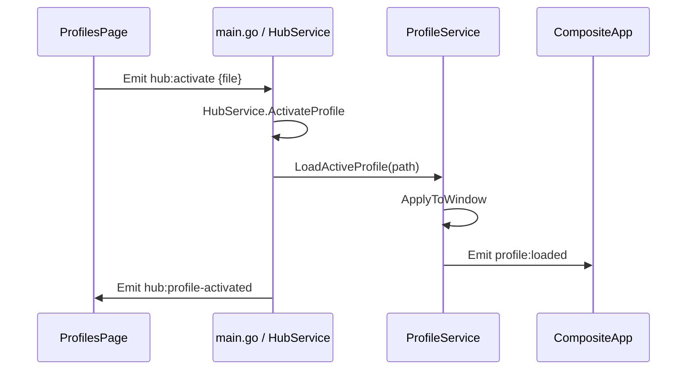

# 09 — Eventos e IPC (Wails)

Comunicación Go ↔ React en v2 usa **Wails v3 Events** y **Services** registrados.

---

## Emitter Go

`cmd/vantare/main.go` implementa `wailsEmitter.Emit(name, data)` → `wailsApp.Event.Emit`.

Frontend importa:

```typescript
import { Events } from "@wailsio/runtime";
Events.Emit("hub:list");
Events.On("hub:profiles", (event) => { ... });
```

---

## Eventos hub (CRUD)

| Evento (JS → Go) | Payload | Respuesta / efecto |
|------------------|---------|-------------------|
| `hub:list` | — | Go emite `hub:profiles` `{ profiles: ProfileEntry[] }` |
| `hub:create` | `{ name: string }` | OK → `hub:profile-created`; error → `hub:error` |
| `hub:delete` | `{ id, file }` | OK → `hub:profile-deleted`; error → `hub:error` |
| `hub:activate` | `{ id, file }` | OK → `hub:profile-activated` + overlay `profile:loaded`; error → `hub:error` |

**Preferir `file`** (basename, ej. `example-racing.json`) cuando el id JSON difiere del nombre archivo.

### Errores

`hub:error` → `{ message: string }` — mostrar en ProfilesPage.

---

## Eventos perfil / overlay

| Evento | Dirección | Payload típico |
|--------|-----------|----------------|
| `profile:loaded` | Go → overlay | `{ profile, layoutOrigin }` |
| `layout:saved` | Go → overlay | `{ ok, profile }` |

Emitidos por `ProfileService` tras load, activate, save layout.

---

## Telemetría

| Evento | Dirección | Notas |
|--------|-----------|-------|
| `telemetry:update` | Go → frontend | Diff payload JSON; merge en `telemetry-ref.ts` |

Bridge: `internal/app/telemetry_bridge.go` suscribe a `telemetry.Service`.

**Anti-patrón:** Hacer `setState` React en cada tick 30 Hz para todo el árbol.

---

## Services Wails (callable desde JS)

Registrados en `main.go`:

- **ProfileService** — métodos Go expuestos (GetProfile, SaveLayout, …)
- **HubService** — ListProfiles, CreateProfile, … (también usable vía eventos)

En F5 el hub usa principalmente **eventos** para CRUD; services disponibles para expansión.

---

## Ventanas y URLs

| Ventana | URL Wails | React root |
|---------|-----------|------------|
| Overlay | `/` | `CompositeApp` |
| Hub | `/#/hub` | `HubApp` |

Mismo build `frontend/dist`; routing por hash en `main.tsx`.

---

## Diagrama hub activate



---

## Futuro Fase 6 (OBS)

Mismo diff payload por **SSE** en lugar de (o además de) Wails Events:

```
GET /health
GET /overlay?profile=...
GET /telemetry/stream   (text/event-stream)
```

Sin cambiar el normalizer — solo otro transporte desde Go.
