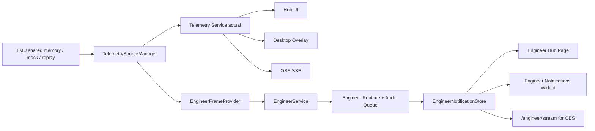

# Vantare Suite Ingeniero Integration Implementation Plan

> **For agentic workers:** REQUIRED SUB-SKILL: Use superpowers:subagent-driven-development (recommended) or superpowers:executing-plans to implement this plan task-by-task. Steps use checkbox (`- [ ]`) syntax for tracking.

**Goal:** Integrar Vantare Ingeniero dentro de la app actual como modulo de suite, con una seccion propia en el Hub y un widget de overlay capaz de mostrar notificaciones del ingeniero/spotter.

**Architecture:** Una sola app Wails, un solo proceso y una sola fuente de telemetria activa. El codigo util de `C:\Users\isaac\Desktop\Vantare-Ingeniero-Go` se incorpora como modulo interno `internal/engineer`, mientras la UI se rehace dentro del Hub actual y los overlays consumen un bus de notificaciones compartido.

**Tech Stack:** Go 1.25, Wails v3, React 19, TypeScript, SSE HTTP local para OBS, eventos Wails para Hub/overlay desktop, perfiles JSON schema v2 y widget variants existentes.

---

## Resumen Ejecutivo

Vantare debe evolucionar de "una app de overlays" a "suite de apps de simracing". La integracion correcta no es pegar dos apps Wails, ni ejecutar dos procesos, ni mantener dos lectores LMU. La opcion estable es convertir Vantare Ingeniero en un modulo interno de la app actual:

```text
Vantare Hub
  Overlays Studio
  Ingeniero
  Telemetria
  Setup

Go runtime unico
  TelemetrySourceManager actual
  Overlay/Profile services actuales
  EngineerService nuevo
  EngineerNotificationStore nuevo
  HTTP/SSE server actual extendido para OBS
```

La primera version integrable debe probar Ingeniero con simulator/replay, sin depender aun de LMU live. La version live real necesita una fase separada porque el modelo publico actual de Overlays no expone geometria completa por coche, y el spotter de Ingeniero necesita posicion, orientacion y velocidad local.

## Analisis De Repositorios

### Repo actual: `vantare-v2`

Stack y patrones existentes:

- Go/Wails + React/TypeScript.
- `cmd/vantare/main.go` crea un unico `application.App`, servicios Wails, Hub, overlay desktop y servidor HTTP/OBS.
- `internal/app.App` posee `TelemetrySourceManager` y `TelemetryService`.
- `internal/telemetry/service.Service` emite snapshots a subscribers.
- Desktop overlay recibe `telemetry:update` por eventos Wails.
- OBS recibe `/telemetry/stream` por SSE.
- `WidgetRenderer` centraliza render de widgets para previews.
- `CompositeApp` y `ObsOverlayApp` tienen mapas locales de widgets.
- `WidgetStudio` no edita posicion/tamano; `LayoutStudio` si.

Restricciones importantes:

- No reintroducir `PreviewWidgetFrame` en `WidgetStudio`.
- No duplicar source state ni telemetry readers.
- No cambiar schema de perfiles salvo miniplan propio.
- No tocar pagos, multisim ni reworks UI amplios en esta integracion inicial.

### Repo externo: `Vantare-Ingeniero-Go`

Estado real observado:

- No es solo un scaffold: ya contiene core de spotter, replay, simulator, audio queue, TTS y UI minima.
- `internal/core.Runtime` procesa frames y encola `audio.Message`.
- `internal/spotter` contiene maquina determinista y geometria CrewChief-style.
- `internal/telemetry.Frame` incluye campos que Overlays no expone hoy: `Position`, `LocalVelocity`, `Orientation`, `PathLateral`, `TrackEdge`.
- `app.Manager` abre su propia fuente `lmu/replay/simulator`, crea runtime y reproduce audio.
- Frontend Ingeniero es una UI minima React 18 con bindings generados; no debe importarse tal cual.

Restricciones de Ingeniero:

- No cambiar signos/geometria del spotter por intuicion.
- La UI no debe contener logica de carrera.
- Replay/fixtures son parte central de validacion.
- El foco prealpha es spotter LMU fiable, no IA/pit manager.

## Opciones Evaluadas

### Opcion A: importar `Vantare-Ingeniero-Go` como modulo Go con `replace`

Rechazada para esta etapa.

Motivos:

- Sus paquetes estan bajo `internal/`, por lo que Go no permite importarlos desde otro modulo.
- Su `go.mod` declara Go 1.26.4 y el repo actual usa Go 1.25.0.
- El build instalable dependeria de una ruta local externa.
- Los bindings/frontend generados no encajan con el frontend React 19 actual.

### Opcion B: copiar toda la app Ingeniero dentro de `apps/ingeniero`

Rechazada para esta etapa.

Motivos:

- Mantendria dos shells Wails, dos frontends, dos entrypoints y dos ciclos de vida.
- No resuelve bien el widget de notificaciones en overlays.
- Introduce arquitectura de monorepo antes de tener una necesidad real.

### Opcion C: ejecutar Ingeniero como proceso separado y comunicar por IPC

Rechazada para esta etapa.

Motivos:

- Contradice la decision de producto "una app, un proceso".
- Complica instalador, logs, lifecycle, errores y soporte a testers.
- Hace mas dificil que OBS consuma las notificaciones.

### Opcion D: incorporar el core como modulo interno `internal/engineer`

Aprobada como recomendacion.

Motivos:

- Mantiene una sola app Wails.
- Permite reutilizar simulator/replay/spotter/audio queue.
- Evita dependencias locales externas.
- Permite que Hub, desktop overlay y OBS consuman el mismo `EngineerNotificationStore`.
- Encaja con el estilo actual del repo: Go core, React UI, Wails events y SSE para OBS.

## Arquitectura Objetivo



Reglas:

- `TelemetrySourceManager` sigue siendo el owner de la fuente activa.
- `EngineerService` consume frames; no abre una segunda fuente LMU.
- En fase inicial, `EngineerService` puede usar simulator/replay interno mientras el adapter live se prepara.
- Las notificaciones son datos de producto, no audio. El widget de overlay lee notificaciones, no reproduce TTS.
- Audio/TTS debe poder desactivarse sin romper el widget.

## Contratos Nuevos

### EngineerStatus

```go
type EngineerStatus struct {
	Enabled         bool                   `json:"enabled"`
	Connected       bool                   `json:"connected"`
	Source          string                 `json:"source"`
	SpotterEnabled  bool                   `json:"spotterEnabled"`
	Sensitivity     string                 `json:"sensitivity"`
	TTSCacheCount   int                    `json:"ttsCacheCount"`
	RecentMessages  []EngineerNotification `json:"recentMessages"`
	LastError        string                 `json:"lastError,omitempty"`
}
```

### EngineerNotification

```go
type EngineerNotification struct {
	ID        string `json:"id"`
	Category  string `json:"category"`  // spotter, engineer, pit, system
	Severity  string `json:"severity"`  // info, warning, critical
	TextKey   string `json:"textKey"`
	Text      string `json:"text"`
	Priority  int    `json:"priority"`
	CreatedAt int64  `json:"createdAt"`
	ExpiresAt int64  `json:"expiresAt,omitempty"`
	Source    string `json:"source"`    // simulator, replay, lmu
}
```

### Widget type

```ts
type EngineerNotificationsWidgetType = "engineer-notifications";
```

Este widget muestra la notificacion activa mas reciente o una cola breve. Su entrada inicial debe ser opt-in: no se anade automaticamente a todos los perfiles existentes.

## Estructura De Archivos Objetivo

```text
internal/engineer/
  audio/
  core/
  replay/
  simulator/
  spotter/
  telemetry/
  tts/
  service/
    notification.go
    notification_store.go
    engineer_service.go
    simulator_runner.go
    overlays_live_adapter.go

internal/app/
  engineer_bridge.go

internal/server/
  engineer_sse.go

frontend/src/engineer/
  engineer-types.ts
  engineer-api.ts
  useEngineerStatus.ts
  useEngineerNotifications.ts

frontend/src/hub/pages/
  EngineerPage.tsx
  EngineerPage.test.tsx

frontend/src/overlay/widgets/
  EngineerNotificationsWidget.tsx
  EngineerNotificationsWidget.test.tsx

docs/
  vantare-suite-ingeniero-architecture.md
  engineer-manual-verification.md
```

## Miniplanes

### EN0 - Inventario De Integracion

**Objetivo:** confirmar exactamente que se copia de Ingeniero, que se descarta y donde estan los gaps de datos live.

**Tipo:** documentacion/inventario.

**Archivos:**

- Crear: `docs/vantare-suite-ingeniero-integration-inventory.md`
- Leer: `C:\Users\isaac\Desktop\Vantare-Ingeniero-Go\AGENTS.md`
- Leer: `C:\Users\isaac\Desktop\Vantare-Ingeniero-Go\docs\current-plan.md`
- Leer: `C:\Users\isaac\Desktop\Vantare-Ingeniero-Go\docs\architecture\0001-prealpha-architecture.md`
- Leer: `C:\Users\isaac\Desktop\Vantare-Ingeniero-Go\internal\core\runtime.go`
- Leer: `C:\Users\isaac\Desktop\Vantare-Ingeniero-Go\internal\spotter\*.go`
- Leer: `C:\Users\isaac\Desktop\Vantare-Ingeniero-Go\internal\telemetry\model.go`
- Leer: `C:\Users\isaac\Desktop\Vantare-Ingeniero-Go\internal\audio\*.go`
- Leer: `pkg/models/telemetry.go`
- Leer: `internal/telemetry/lmu/parser.go`

**Pasos:**

- [ ] Revisar `git status --short` en `vantare-v2`.
- [ ] Crear el documento de inventario.
- [ ] Listar paquetes que se copiaran inicialmente:
  - `internal/telemetry` -> `internal/engineer/telemetry`
  - `internal/spotter` -> `internal/engineer/spotter`
  - `internal/core` -> `internal/engineer/core`
  - `internal/audio` -> `internal/engineer/audio`
  - `internal/simulator` -> `internal/engineer/simulator`
  - `internal/replay` -> `internal/engineer/replay`
- [ ] Listar paquetes que NO se copian en EN1:
  - `app/`
  - `cmd/`
  - `frontend/`
  - `build/`
  - bindings generados
  - `internal/sim/lmu` como source owner
- [ ] Documentar gap live: Overlays no expone `Position`, `Orientation` ni `LocalVelocity` por vehiculo en `pkg/models`.
- [ ] Documentar decision: simulator/replay primero; LMU live despues con adapter propio.
- [ ] Ejecutar: `git diff --check`.

**Criterio de aceptacion:**

- El documento permite a un worker ejecutar EN1 sin leer este chat.
- No hay codigo modificado.

### EN1 - Copiar Core Determinista De Ingeniero

**Objetivo:** tener el core de Ingeniero dentro del repo actual, compilando y testeado bajo `internal/engineer`, sin conectarlo todavia a la app.

**Tipo:** migracion controlada de codigo.

**Archivos:**

- Crear: `internal/engineer/telemetry/*`
- Crear: `internal/engineer/spotter/*`
- Crear: `internal/engineer/audio/*`
- Crear: `internal/engineer/core/*`
- Crear: `internal/engineer/simulator/*`
- Crear: `internal/engineer/replay/*`
- No tocar: `cmd/vantare/main.go`
- No tocar: `frontend/**`
- No tocar: `pkg/models/**`

**Pasos:**

- [ ] Copiar los paquetes permitidos desde `C:\Users\isaac\Desktop\Vantare-Ingeniero-Go`.
- [ ] Cambiar imports de:

```go
github.com/vantare/ingeniero-go/internal/audio
```

a:

```go
github.com/vantare/overlays/v2/internal/engineer/audio
```

- [ ] Repetir el cambio de import para `core`, `spotter`, `telemetry`, `simulator` y `replay`.
- [ ] Mantener tests originales de esos paquetes.
- [ ] Ejecutar:

```powershell
go test ./internal/engineer/...
```

- [ ] Ejecutar:

```powershell
go test ./...
```

- [ ] Ejecutar:

```powershell
git diff --check
```

**Criterio de aceptacion:**

- `go test ./internal/engineer/...` pasa.
- No hay cambios de comportamiento en la app actual.
- No se modifica `go.mod` salvo que el worker demuestre que es inevitable; si intenta subir a Go 1.26, debe parar.

### EN2 - Servicio Ingeniero Con Simulator/Replay

**Objetivo:** crear `EngineerService` dentro de la app actual, pero usando simulator/replay para probar UI y notificaciones sin depender de LMU live.

**Tipo:** backend Go.

**Archivos:**

- Crear: `internal/engineer/service/notification.go`
- Crear: `internal/engineer/service/notification_store.go`
- Crear: `internal/engineer/service/engineer_service.go`
- Crear: `internal/engineer/service/engineer_service_test.go`
- Crear: `internal/app/engineer_bridge.go`
- Modificar: `cmd/vantare/main.go`

**Contrato minimo:**

```go
type EngineerService struct {
	store *NotificationStore
}

func (s *EngineerService) Status() EngineerStatus
func (s *EngineerService) SetEnabled(enabled bool) error
func (s *EngineerService) SetSource(source string) error
func (s *EngineerService) SetSpotterEnabled(enabled bool) error
func (s *EngineerService) SetSensitivity(value string) error
func (s *EngineerService) RecentNotifications() []EngineerNotification
```

Fuentes validas iniciales:

```go
const (
	EngineerSourceSimulator = "simulator"
	EngineerSourceReplay    = "replay"
)
```

**Pasos:**

- [ ] Crear tests de `NotificationStore`: orden por `CreatedAt`, limite 50, deep copy en salida.
- [ ] Crear tests de `EngineerService`: source invalida devuelve error, status inicial es simulator, toggles no paniquean.
- [ ] Implementar store y service.
- [ ] Registrar servicio Wails en `cmd/vantare/main.go` sin cambiar servicios existentes.
- [ ] Emitir evento Wails `engineer:status` cuando cambie estado.
- [ ] Emitir evento Wails `engineer:notification` cuando entra una notificacion.
- [ ] Ejecutar:

```powershell
go test ./internal/engineer/... ./internal/app
```

- [ ] Ejecutar:

```powershell
go test ./...
```

**Criterio de aceptacion:**

- El servicio existe y se puede registrar.
- No abre LMU.
- No reproduce audio todavia.

### EN3 - Pagina Hub "Ingeniero"

**Objetivo:** anadir una seccion visible en la UI para probar Ingeniero desde la app actual.

**Tipo:** frontend React.

**Archivos:**

- Crear: `frontend/src/engineer/engineer-types.ts`
- Crear: `frontend/src/engineer/useEngineerStatus.ts`
- Crear: `frontend/src/hub/pages/EngineerPage.tsx`
- Crear: `frontend/src/hub/pages/EngineerPage.test.tsx`
- Modificar: `frontend/src/hub/HubApp.tsx`
- Modificar: `frontend/src/hub/components/Topbar.tsx`

**UI minima:**

- Nav item: `Ingeniero`.
- Estado: conectado/desconectado.
- Fuente: simulator/replay.
- Toggle: Ingeniero activo.
- Toggle: Spotter activo.
- Select: sensibilidad conservative/normal/aggressive.
- Panel: mensajes recientes.
- Estado TTS cache si el backend lo expone.

**Pasos:**

- [ ] Crear tipos TS equivalentes a `EngineerStatus` y `EngineerNotification`.
- [ ] Crear hook que escuche:

```ts
Events.On("engineer:status", ...)
Events.On("engineer:notification", ...)
Events.Emit("engineer:status:get")
```

- [ ] Crear `EngineerPage` sin copiar el frontend React 18 de Ingeniero.
- [ ] Anadir `engineer` al union type de `HubApp`.
- [ ] Anadir `Ingeniero` a `NAV_ITEMS`.
- [ ] Tests:
  - renderiza titulo `Ingeniero`;
  - muestra source simulator;
  - al pulsar toggle emite evento correcto;
  - al recibir `engineer:notification` aparece en timeline.
- [ ] Ejecutar:

```powershell
pnpm --dir frontend test -- EngineerPage HubApp Topbar
pnpm --dir frontend exec tsc -b
pnpm --dir frontend build
```

**Criterio de aceptacion:**

- Se puede abrir una seccion `Ingeniero` dentro del Hub.
- No cambia `Overlays Studio`.
- No cambia `LayoutStudio`.

### EN4 - Bus De Notificaciones Para Hub, Desktop Overlay Y OBS

**Objetivo:** hacer que las notificaciones del ingeniero tengan un canal comun consumible por UI y overlays.

**Tipo:** backend Go + frontend util.

**Archivos:**

- Crear: `internal/server/engineer_sse.go`
- Modificar: `internal/server/server.go`
- Modificar: `internal/server/sse_test.go` o crear `internal/server/engineer_sse_test.go`
- Crear: `frontend/src/engineer/useEngineerNotifications.ts`
- Crear: `frontend/src/engineer/useEngineerNotifications.test.ts`

**Eventos/canales:**

- Wails desktop: `engineer:notification`.
- HTTP OBS: `GET /engineer/stream`.
- Snapshot HTTP opcional: `GET /api/engineer/notifications`.

**Pasos:**

- [ ] Extender `server.ServerConfig` para recibir un `EngineerNotificationSource`.
- [ ] Anadir endpoint `GET /engineer/stream`.
- [ ] El SSE debe enviar:

```text
event: engineer-notification
data: {"id":"...","text":"..."}
```

- [ ] Mantener keep-alive igual que `/telemetry/stream`.
- [ ] Crear hook frontend que use Wails events si existe runtime Wails y SSE si esta en OBS/browser.
- [ ] Tests backend:
  - endpoint devuelve `503` si no hay source;
  - endpoint emite `event: engineer-notification`;
  - keep-alive no bloquea.
- [ ] Tests frontend:
  - agrega notificacion recibida;
  - ignora payload invalido sin romper UI.

**Criterio de aceptacion:**

- Hub y OBS pueden recibir el mismo tipo de notificacion.
- No se modifica `/telemetry/stream`.

### EN5 - Widget De Overlay `engineer-notifications`

**Objetivo:** anadir un widget que muestre las notificaciones del ingeniero cuando este habla.

**Tipo:** frontend overlay + schema-compatible widget type.

**Archivos:**

- Crear: `frontend/src/overlay/widgets/EngineerNotificationsWidget.tsx`
- Crear: `frontend/src/overlay/widgets/EngineerNotificationsWidget.test.tsx`
- Modificar: `frontend/src/hub/preview/WidgetRenderer.tsx`
- Modificar: `frontend/src/overlay/CompositeApp.tsx`
- Modificar: `frontend/src/overlay/ObsOverlayApp.tsx`
- Modificar: `frontend/src/hub/preview/WidgetList.tsx`
- Modificar: `frontend/src/lib/canvas-math.ts` solo si necesita ratio fijo simple.

**Comportamiento inicial:**

- Si no hay notificaciones activas, render transparente o placeholder en edit mode.
- Si hay notificacion activa, mostrar texto con estilo compacto Vantare.
- Respetar `ExpiresAt`.
- No reproducir audio.
- No depender de telemetry ref.
- Desktop overlay usa Wails event.
- OBS usa `/engineer/stream`.

**Pasos:**

- [ ] Crear test de widget en edit mode con mock message.
- [ ] Crear test de widget sin mensajes: no muestra caja en runtime.
- [ ] Crear test de expiracion.
- [ ] Registrar widget en `WidgetRenderer`.
- [ ] Registrar widget en `CompositeApp` y `ObsOverlayApp`.
- [ ] Anadirlo a `WidgetList`.
- [ ] No crear variantes complejas en el primer corte; usar `props` simples:

```ts
{
  maxVisible: 1,
  durationMs: 3500,
  severityFilter: "all"
}
```

- [ ] Ejecutar:

```powershell
pnpm --dir frontend test -- EngineerNotificationsWidget WidgetRenderer CompositeApp ObsOverlayApp WidgetList
pnpm --dir frontend test
pnpm --dir frontend exec tsc -b
pnpm --dir frontend build
```

**Criterio de aceptacion:**

- El widget existe y puede renderizar notificaciones en preview/desktop/OBS.
- No se anade automaticamente a perfiles existentes.
- Si se anade manualmente a un perfil, no rompe otros widgets.

### EN6 - Adapter Live LMU Sin Segundo Lector

**Objetivo:** conectar el spotter de Ingeniero a LMU live usando la fuente actual de Overlays, sin abrir un segundo mmap reader.

**Tipo:** backend Go critico.

**Archivos:**

- Crear: `internal/engineer/service/overlays_live_adapter.go`
- Crear: `internal/engineer/service/overlays_live_adapter_test.go`
- Crear o modificar: `internal/telemetry/lmu/engineer_parser.go`
- Crear o modificar: `internal/telemetry/lmu/engineer_parser_test.go`
- Modificar: `internal/app/lmu_enriched_source.go` si se decide exponer `ReadEngineerFrame`.
- Modificar: `internal/app/app.go` solo para exponer fuente al `EngineerService`.

**Decision tecnica preferida:**

Crear una interfaz local:

```go
type EngineerFrameSource interface {
	ReadEngineerFrame() *engineertelemetry.Frame
}
```

Implementarla en el wrapper LMU actual:

```go
func (s *EnrichedLMUSource) ReadEngineerFrame() *engineertelemetry.Frame {
	return engineerparser.ParseFrame(s.mmap.Read())
}
```

**Reglas:**

- No modificar `pkg/models.Telemetry` en este paso salvo que GLM apruebe que es necesario.
- No usar el JSON publico de widgets para spotter geometry.
- No abrir `lmu.OpenSource()` desde Ingeniero.
- No copiar `internal/sim/lmu` como source owner activo.

**Pasos:**

- [ ] Copiar/adaptar solo el parseo de geometria LMU que falta, no todo el source owner.
- [ ] Crear test con buffer sintetico que valide `Position`, `LocalVelocity`, `Orientation`.
- [ ] Crear test de `EnrichedLMUSource.ReadEngineerFrame`.
- [ ] Conectar `EngineerService` para usar live si la source implementa `EngineerFrameSource`.
- [ ] Si no hay source live compatible, caer a simulator/replay con status claro.
- [ ] Ejecutar:

```powershell
go test ./internal/telemetry/lmu ./internal/engineer/... ./internal/app
go test ./...
```

**Criterio de aceptacion:**

- Live LMU alimenta el spotter sin segundo lector.
- Simulator/replay siguen funcionando.
- Widgets existentes no cambian su payload.

### EN7 - Audio/TTS Integrado Y Desacoplado Del Widget

**Objetivo:** activar audio/TTS de Ingeniero dentro de la suite sin que las notificaciones visuales dependan del audio.

**Tipo:** backend Go.

**Archivos:**

- Crear o adaptar: `internal/engineer/tts/*`
- Crear o adaptar: `internal/engineer/service/audio_runner.go`
- Crear: `internal/engineer/service/audio_runner_test.go`
- Modificar: `internal/engineer/service/engineer_service.go`

**Reglas:**

- Audio se puede desactivar.
- Si Edge/Kokoro no esta disponible, el sistema sigue emitiendo notificaciones visuales.
- No bloquear spotter por TTS.
- No meter IA.

**Pasos:**

- [ ] Copiar TTS/cache solo si no introduce dependencias nuevas.
- [ ] Mantener cache path bajo config de Vantare actual, por ejemplo `%APPDATA%/Vantare/engineer/tts-cache`.
- [ ] `EngineerService` debe tener flags:

```go
AudioEnabled bool
TTSEnabled   bool
```

- [ ] Tests:
  - si TTS falla, notificacion sigue guardada;
  - si audio esta off, no se llama player;
  - cache count se refleja en status.
- [ ] Ejecutar:

```powershell
go test ./internal/engineer/...
go test ./...
```

**Criterio de aceptacion:**

- Audio no rompe UI ni widget.
- Mensajes visuales siempre llegan aunque TTS falle.

### EN8 - Persistencia De Ajustes De Ingeniero

**Objetivo:** guardar configuracion de Ingeniero sin mezclarla con perfiles de overlay.

**Tipo:** backend Go + frontend.

**Archivos:**

- Crear: `internal/app/engineer_settings_service.go`
- Crear: `internal/app/engineer_settings_service_test.go`
- Crear: `frontend/src/engineer/engineer-settings.ts`
- Modificar: `frontend/src/hub/pages/EngineerPage.tsx`

**Ruta recomendada:**

```text
%APPDATA%/Vantare/engineer-settings.json
```

**Formato inicial:**

```json
{
  "enabled": true,
  "source": "simulator",
  "spotterEnabled": true,
  "sensitivity": "normal",
  "audioEnabled": false,
  "ttsEnabled": false
}
```

**Reglas:**

- No guardar ajustes de Ingeniero dentro de perfiles overlay.
- No activar audio por defecto en alpha sin confirmacion manual.
- No guardar source `lmu` si live no esta listo.

**Criterio de aceptacion:**

- Cerrar/reabrir conserva ajustes de Ingeniero.
- No cambia ningun perfil JSON de overlays.

### EN9 - Documentacion, Checklist Manual Y Version

**Objetivo:** cerrar la primera integracion de suite con documentos de uso, bugs conocidos y version publicable.

**Tipo:** documentacion/release.

**Archivos:**

- Crear: `docs/vantare-suite-ingeniero-architecture.md`
- Crear: `docs/engineer-manual-verification.md`
- Modificar: `docs/current-plan.md`
- Modificar: `docs/master-feature-plan.md`
- Modificar: `docs/roadmap-execution-board.md`
- Modificar: `docs/changelog.md`

**Checklist manual minima:**

1. Abrir app.
2. Ir a `Ingeniero`.
3. Activar simulator.
4. Ver mensajes recientes.
5. Activar/desactivar spotter.
6. Anadir widget `engineer-notifications` a un perfil de prueba.
7. Abrir overlay desktop.
8. Ver que el widget muestra mensajes del ingeniero.
9. Abrir OBS URL y confirmar SSE de notificaciones.
10. Confirmar que `Overlays Studio` y `LayoutStudio` no mezclan responsabilidades.

**Versionado:**

- No taggear EN0 documental.
- Taggear solo cuando haya una build funcional confirmada.
- Version sugerida para primer checkpoint de suite: `v0.4.0.0` o version que el usuario apruebe, porque cambia el alcance de producto de Overlays a Suite.

## Orden Recomendado

1. EN0 inventario.
2. EN1 core copiado y testeado.
3. EN2 service simulator/replay.
4. EN3 pagina Hub.
5. EN4 bus de notificaciones.
6. EN5 widget de overlay.
7. Verificacion manual de simulator/replay.
8. EN6 live LMU adapter.
9. EN7 audio/TTS.
10. EN8 persistencia.
11. EN9 docs/version.

## Paralelizacion Segura

Se puede paralelizar:

- EN0 documentacion con una review de arquitectura.
- EN3 frontend page mock si EN2 ya fija contratos TS/JSON.
- EN5 widget visual si EN4 ya fija `EngineerNotification`.

No paralelizar:

- EN1 y EN6, porque ambos tocan modelos/paquetes core.
- EN2 y EN7, porque ambos tocan `EngineerService`.
- EN4 y EN5 sin contrato cerrado de notificacion.
- Cualquier cambio en `cmd/vantare/main.go` con otro cambio de lifecycle Wails.

## Stop Conditions

Parar y pedir revision si:

- Aparece necesidad de subir Go a 1.26.
- Hay que tocar `pkg/models.Telemetry` para geometry live.
- Hace falta abrir un segundo reader LMU.
- Se necesita dependencia nueva.
- Se intenta copiar frontend/bindings generados de Ingeniero.
- El widget de notificaciones requiere cambiar schema de perfiles.
- Audio/TTS bloquea notificaciones visuales.
- OBS no puede recibir notificaciones por SSE.

## Checks Globales Para Cada Checkpoint Funcional

```powershell
go test ./internal/engineer/... ./internal/app ./internal/server
go test ./...
pnpm --dir frontend test
pnpm --dir frontend exec tsc -b
pnpm --dir frontend build
pnpm --dir frontend lint
git diff --check
```

## Riesgos Principales

1. **Geometry live incompleta.** Overlays no expone hoy todos los campos que Ingeniero necesita. Mitigacion: simulator/replay primero; adapter live separado.
2. **Doble telemetria.** Importar el manager de Ingeniero tal cual abriria otra fuente LMU. Mitigacion: `EngineerService` consume `TelemetrySourceManager` actual.
3. **OBS separado de Wails.** Eventos Wails no llegan a OBS Browser Source. Mitigacion: SSE propio `/engineer/stream`.
4. **Audio/TTS fragil.** Edge/Kokoro pueden no existir en maquina tester. Mitigacion: notificaciones visuales independientes del audio.
5. **Scope creep de suite.** Integrar Ingeniero puede arrastrar IA, pit manager o multisim. Mitigacion: primera fase solo spotter simulator/replay, UI y notificaciones.
6. **Confusion de producto.** La app se llama ahora Vantare Overlays, pero Vantare es suite. Mitigacion: cambiar arquitectura de navegacion gradualmente, sin rework visual completo.

## Decision Final Recomendada

Ejecutar EN0-EN5 como primer bloque de integracion de suite. Eso permite probar `Ingeniero` dentro de la UI y mostrar sus mensajes en overlays sin arriesgar el pipeline LMU live. Despues ejecutar EN6 como fase tecnica especifica para spotter live real.

No ejecutar EN7 audio/TTS hasta que las notificaciones visuales funcionen en Hub, desktop overlay y OBS.

